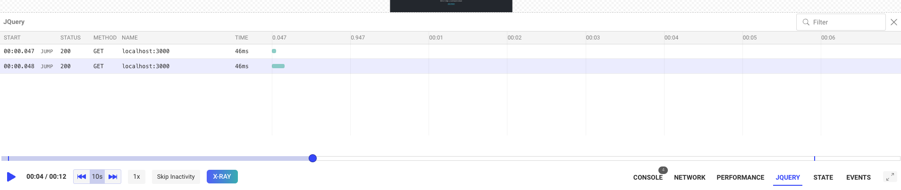
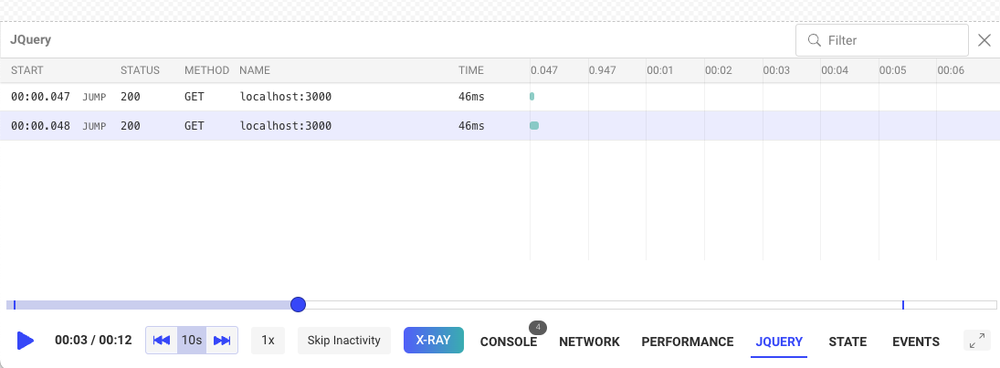

If you’re self-hosting your version of OpenReplay, you have the added benefit of being able to develop and install custom  plugins. That would let you add functionality and compatiblity that OpenReplay out-of-the-box does not provide.

Right now, there are a few plugins developed and maintained by the OpenReplay team, such as the [Redux plugin](/plugins/redux), which lets you track state changes, or the [Fetch plugin](/plugins/fetch), which gives you the ability to record Request and Response data. You can look at the [complete list of plugins here](/plugins) if you want to know more.

In this tutorial, you’ll learn how to build your own plugin. Specifically, we will build a plugin that keeps track of JQuery’s GET method.

## Building a plugin from scratch

We recommend that you start by copy&pasting the folder of a plugin that does something similar to what you’re looking to do, that way, you’ll have all the logic and setup code ready.

That said, since the plugin we're going to be building here will behave similarly to how the Fetch plugin does, we're going to duplicate that plugin.

That said, you’ll still have to do things like:

- Modifying the back-end.
- Adding new messages to the message protocol.
- Building some back-end services from the source.

So if you haven’t gone through the process of [building OpenReplay from source](/deployment/deploy-source), I’d recommend going through that process with the current version of OpenReplay first, because you’ll be doing it multiple times while testing your new code.

If, on the other hand, you already have that part down, keep reading!

## What do you need to build a new plugin?

There are three parts to building a new plugin:

1. First you have to define the type of message your plugin will send to the platform. This message needs to contain all the telemetry you want to track. 
2. Then you have to update the front-end to create a component that can display the data from the plugin. In our case, we’ll add a tab on the replayer that lists all requests done with JQuery.
3. Finally, you'll also have to create the plugin! Remember, that’s what we’re here for. The plugin is the only part of this that you can develop outside of OpenReplay and you’ll install it somewhere else (your app).

Note that the rest of the tutorial will assume you’ve forked our Github repo and have it ready and working somewhere. If you haven’t, please review the [deployment section of our documentation](/deployment) first.

## Step 1: Building your new message

The first thing to do is understand what data you want to capture and showcase with your plugin. In our case, since we’re building something to track GET requests, we should make sure we capture the following items:

- URL: obviously, the URL of the request
- Response: we’ll try to capture some of the responses as well
- Status: the status code received from the server

We’ll also add a “duration” property, to track how long it takes to perform the request and get some data, and we’ll need the “timestamp” of the request for that.

To do this, we’ll have to modify the `mob/messages.rb` file. Thtat is a Ruby file, but don’t worry if you don’t know any Ruby, all you have to do is add a  new record describing your new message, something like this:

```jsx
message 112, 'JQueryGET' do
  string 'Method'
  string 'url'
  string 'response'
  string 'status'
  string 'duration'
  int  'timestamp'
end
```

Notice that I also defined:

- A message ID (112), this is a random number that’s not already in use (you can look at the other messages in the file) and that’s less than 200.
- A message name, this is entirely up to you, just make sure it describes your message type.
- A “method” field, that way we could potentially re-use the message for other methods in the future.

After this is done, you need to make sure the message is accessible from everywhere, so you’ll run 2 scripts inside this folder:

```jsx
$ ruby run.rb
$ sh format.sh
```

Once this is over, the message and its ID will be replicated and added everywhere on the back-end where it’s needed.

Let’s now go into the front-end and look at what we need to change.

## Step 2: Updating the front-end

With the message ready, you’ll want to update the `messageDistributor` function (inside the  `frontend/app/player/MessageDistributor/MessageDistributor.ts` file), which receives all messages and decides what to do with them.

Inside the function, you'll see a big `switch` statement and a new case inside it for your message already (you'll notice that the name used is cased differently than what you used). In the case of this example, for the message type “JQueryGET”, you’ll get a “j_query_get” type.

You'll now want to add the message to a list, the front-end components will use these lists. You’ll do that with the `listAppend` function.

The case should look like this:

```jsx
case 'j_query_get': 
    listAppend("jquery", Resource({
      method: msg.method,
      url: msg.url,
      payload: {},
      response: msg.response,
      status: msg.status,
      type: TYPES.JQUERY,
      time: msg.timestamp - this.sessionStart,
      duration: msg.duration,
      index
    }))
  break;
```

Now, there are a few things we have to do to make this work:

- We have to add the “jquery” list, to do so, we’ll modify the file `frontend/app/player/lists/index.js` and add “jquery” into the `entityNamesWithRed` array.
- We have to add the `TYPES.JQUERY` , which you can do by modifying this file: `frontend/app/types/session/resource.js`

With that done, we'll create the actual component showcasing the data inside the player. Something like this:



To do so, we’ll rely on an existing component, and we’ll copy&paste the Fetch component. To do that, we’ll duplicate the folder `frontend/app/components/Session_/Fetch` and name it “JQuery”.

We'll update every reference to fetch inside the newly created folder to ensure it reads "jquery" (probably a Search&Replace here would make sense).

That will create the visualization component that you then have to manually add. First, you need to edit  the `frontend/app/components/Session_/Player/Controls/Controls.js` file to add the “JQuery” button at the lower right corner of the screen, where all the controls are shown.

Look for the JSX code and add a block like this:

```jsx
{showJQuery && (
  <ControlButton
    disabled={disabled && !inspectorMode}
    onClick={() => toggleBottomTools(JQUERY)}
    active={bottomBlock === JQUERY && !inspectorMode}
    hasErrors={jqueryRedCount > 0}
    count={jqueryCount}
    label="JQUERY"
    noIcon
    labelClassName="!text-base font-semibold"
    containerClassName="mx-2"
  />
)}
```

While at it, make sure you define all relevant variables, such as `showJQuery`, `jqueryCount` , `JQUERY` and `jqueryRedCount`. If you’re unsure how to do that, search for their fetch counterparts, you’ll quickly find them. 

With the button added, you can now edit the `frontend/app/components/Session_/Player/Player.js` file and add the actual component.

To do so, after importing it, make sure you add a block like the following inside the JSX section:

```jsx
{ bottomBlock === JQUERY &&
  <JQuery />
}
```

As part of this, you’ll also have to add the `JQUERY` constant to be exported from the `frontend/app/duck/components/player.js` file.

That will take care of everything.

Now your front-end is ready to display the information, we  need to find a way to generate it. So let’s look at the actual plugin’s code!

## Step 3: Building your plugin

You can create this project wherever you want. The point is to provide an installable package to use in other projects.

So make sure the `package.json` file looks like this:

```jsx
{
  "name": "tracker-jquery",
  "version": "1.0.0",
  "description": "jquery openreplay tracker",
  "main": "src/index.js",
  "scripts": {
    "test": "echo \"Error: no test specified\" && exit 1"
  },
  "author": "",
  "license": "ISC",
  "peerDependencies": {
    "@openreplay/tracker": ">=3.6.0"
  },
  "devDependencies": {
    "@openreplay/tracker": "<latest version of the tracker>",
    "prettier": "^1.18.2",
    "replace-in-files-cli": "^1.0.0"
  }
}
```

And we'll add an `index.js` file inside the project's `src` folder. You’re free to structure this project however you see fit as long as your exported functions follow certain pre-defined criteria.

The anatomy of a plugin is simple: you define a function that when called, returns a new function that expects an  `app` attribute to be passed. This `app` attribute contains the instance of the tracker. Inside the returned function you’re free to do everything you want as long as you send a message through the `app` object. That message will be received by the platform and processed according to a set of rules.

The message format will be the one we defined at the start of this tutorial.

Let me show you what the code for our JQuery plugin looks like:

```jsx
import { App, Messages } from '@openreplay/tracker';

export default function($) {

    const oldGET = $.get;

    return (app) => {

        const newGET = async (settingsObj) => {

            const startTime = performance.now();
            let resp = await fetch(settingsObj.url, {
                method: 'GET'
            })
            const duration = performance.now() - startTime;

            let valueResp = null;

            if(settingsObj.json) {
                valueResp = await resp.json()
            } else {
                valueResp = await resp.text()
            }
            const getStj = (res) => {
                let r = {...res}
                if (r && typeof r.body !== 'string') {
	                try {
	                    r.body = JSON.stringify(r.body)
	                } catch {
	                    r.body = "<unable to stringify>"
	                }
                }
                return JSON.stringify(r)
            }

            const msg = Messages.JQueryGET(
                    'GET',
                    String(settingsObj.url),
                    getStj(resp),
                    resp.status,
                    duration,
                    (new Date()).getTime()
                )
            console.log("Sending a message to the tracker....", msg)

            app.send(msg, true)   
            return valueResp;

        }

        $.get = newGET;

    }
}
```

Essentially all I’m doing is replacing the `.get` method from JQuery by a custom one that actually uses `fetch` behind the curtain (this is totally optional, you could be using JQuery’s GET method as well). And after all requests are performed, the code sends a message using the  `app.send` method. The message is created with the `Messages.JQueryGET` method that was created for us by the Ruby script from before. 

The attributes this message receives, are obviously, the ones we defined as the structure of the message itself during **Step 1.**

### Publishing the plugin

Once you’re done with your local tests and you’re sure the plugin is ready, you’ll need to publish it into NPM.

Follow this guide to understand how to do that: [https://docs.npmjs.com/creating-and-publishing-unscoped-public-packages](https://docs.npmjs.com/creating-and-publishing-unscoped-public-packages)

## Testing the plugin

Once published, you’ll want to use your plugin around. The mechanics of using plugins with the OpenReplay tracker are always the same.

1. You first have to instantiate the tracker.
2. Then you have to call the  `use` method and pass it the resulting function of calling your plugin.
3. Finally, start the tracker with the `start` method.

Here is a code sample of what it looks like to use this plugin inside a React application:

```jsx
import logo from './logo.svg';
import './App.css';
import tracker from 'openreplay-tracker'
import jqueryTracker from 'tracker-jquery'
import { useEffect } from 'react';
import $ from 'jquery'

const t = new tracker({
  __DISABLE_SECURE_MODE: true, //only if you're testing locally
  ingestPoint: "openreplay.<your custom domain>/ingest",
  projectKey: "<your project key>",
})

function App() {
  useEffect(()=> {
    t.use(jqueryTracker($))
    t.start()
    async function doGet() {
      let resp = await $.get({
        url: "http://localhost:3000"
      })
      console.log(resp)
    }

    doGet()
  }, [])
  return (
    <div className="App">
      <header className="App-header">
        
        <p>
          Edit <code>src/App.js</code> and save to reload.
        </p>
        <a
          className="App-link"
          href="https://reactjs.org"
          target="_blank"
          rel="noopener noreferrer"
        >
          Learn React
        </a>
      </header>
    </div>
  );
}

export default App;
```

The code is performing a GET request using Jquery’s `get` method once the page loads, and since we’ve set up our nifty little tracker, we’re actually able to track that request.

Here is what the end result should look like for you:



---

You can [check out this repository](https://github.com/deleteman/openreplay) for the **complete source code** of this tutorial.

If you have any issues with any of the steps of this process, please contact us on our [Slack community](https://slack.openreplay.com/) and ask our devs directly!