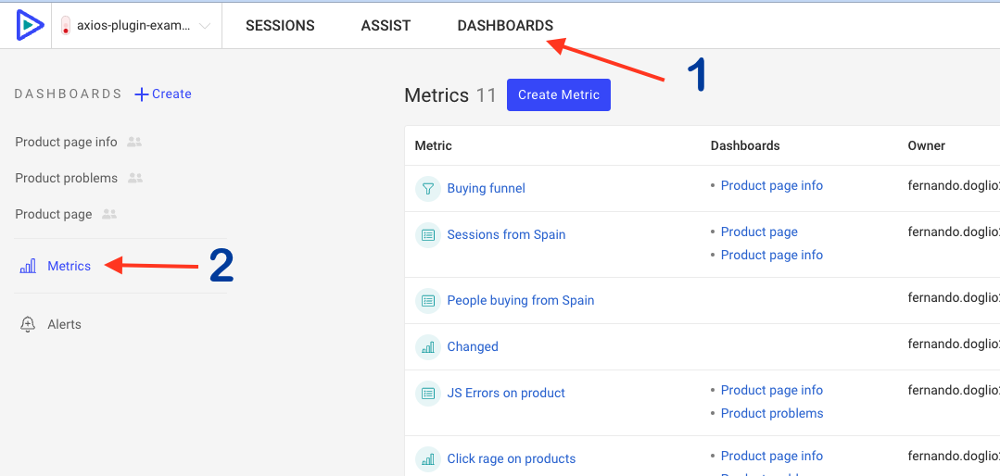
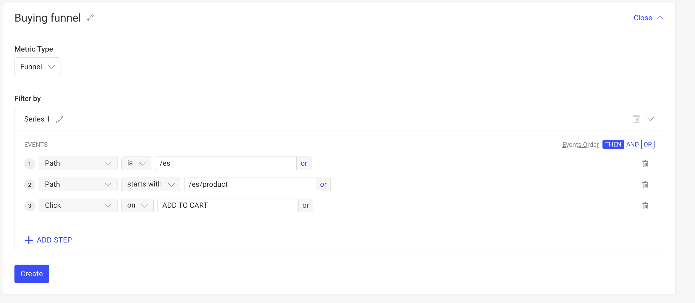
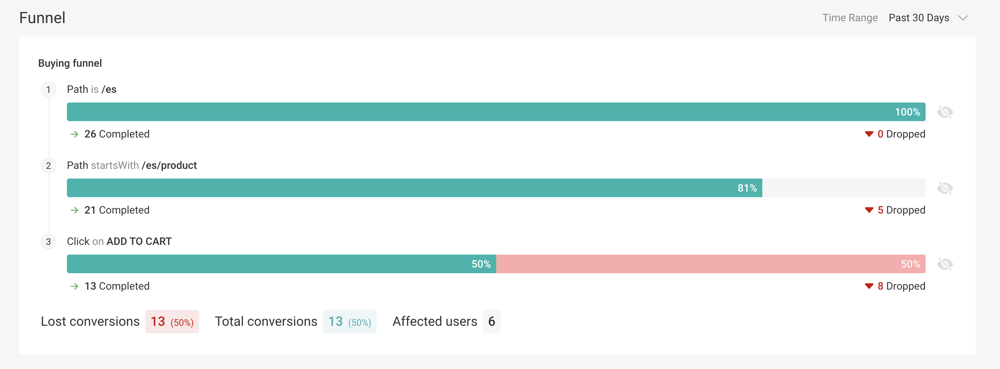
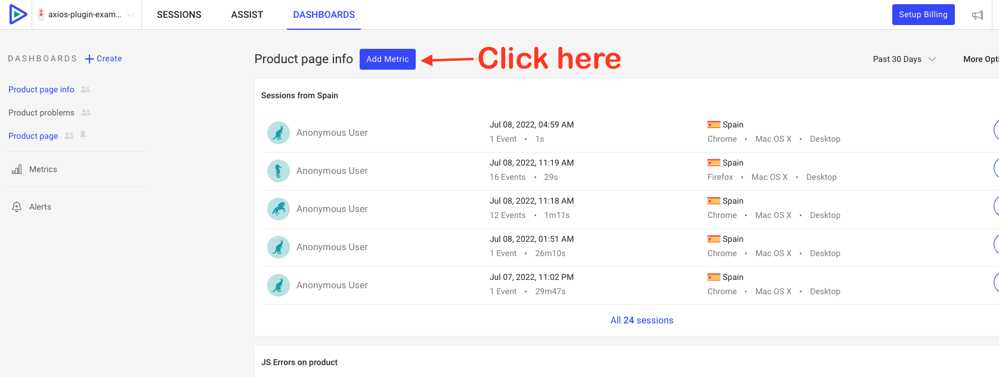
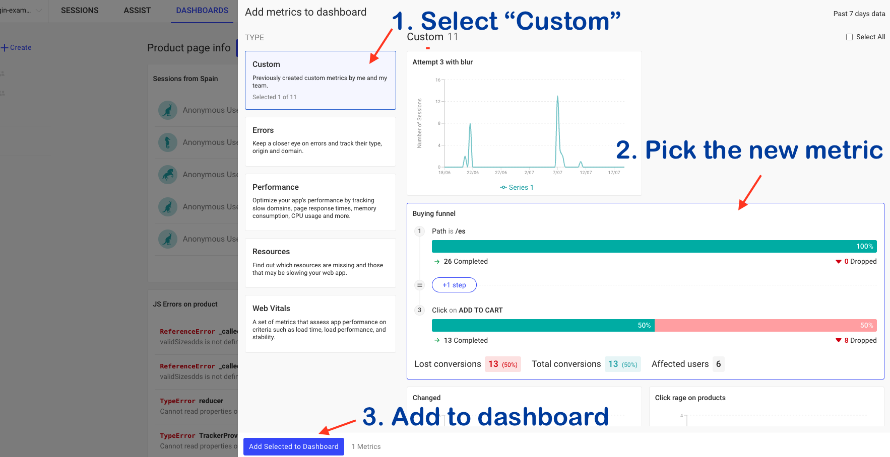

Finding problems sometimes is not as easy as reviewing a single replay. Sometimes problems arise when the user goes through a series of steps.

When those steps lead the user to a desired result (like buying one of your products, or subscribing to your newsletter) they are known as a "funnel".

OpenReplay allows you to analyze and track custom funnels to understand why your users are dropping out of them and not converting.

In this tutorial we’ll see how to set up a funnel to understand how many users our e-commerce site is losing going from the home page to adding a product into their shopping cart.

## Creating your first funnel

**Note** that you don’t need any special plugin or add-on to capture the data needed. With a basic tracker setup, you’ll have everything you need.

Funnels are a type of metric you can create inside the Dashboards section of the top navigation:

Once inside this section, click “Create Metric” and choose the “Funnel” metric type.

Then start adding steps using the filters below. Here is how our funnel tracks users going from other homes all the way to adding a product to their cart:

Notice the events inside the “Series 1” filter:

1. First, ensure the path is “/es”, which  translates to the home page of our site.
2. Then check if the path starts with “/es/product”, which is every single product on our website.
3. Finally, get the sessions that click on the “Add to Cart” button.

Since we’re defining a funnel, every new filter will be more restrictive.

Underneath the filters, you’ll see the results of each step, like this:

You can see that we’re losing 5 users going from step 2 to 3.

And out of all those getting into step 3, only 50% of them do click the button. Now, what could be causing this sudden drop on convertion? We have some clues underneath the funnel.

We have High CPU issues, dead clicks and even some custom events that might give us some clues as to what is happening.

The issues provide some insight into their effect inside the funnel, so you can review and focus on the worst ones.

If you click on one of these errors, you’ll get a list of replays affected by it inside the funnel, so you can analyze the right replays:

You can now add the metric to one or more dashboards to use it.

## Adding your metric into a dashboard

To add your brand new metric to a dashboard, go to the Dashboards section, pick the one you want to work on, and click “Add Metric”.

Select the new metric from the Custom section and then click on “Add Selected to Dashboard”:

## Do you have questions?

If you have any issues creating funnels in you project, please contact us on our [Slack community](https://slack.openreplay.com/) and ask our devs directly!