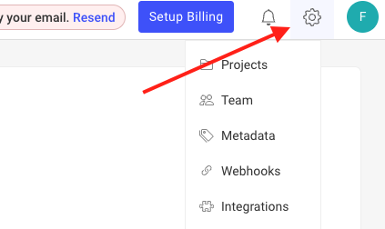
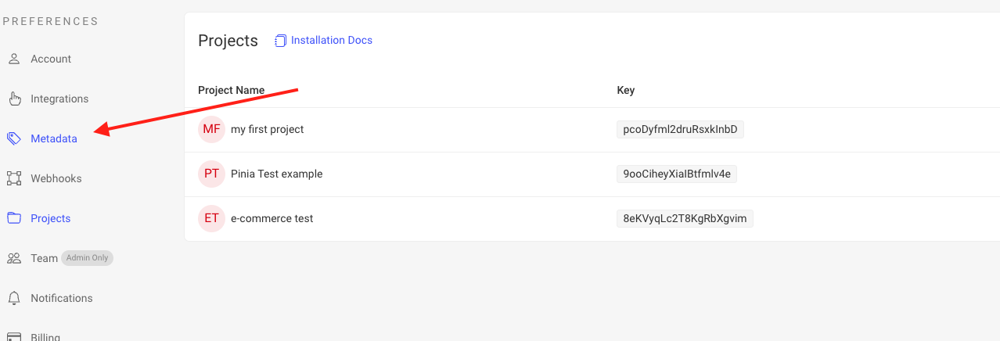
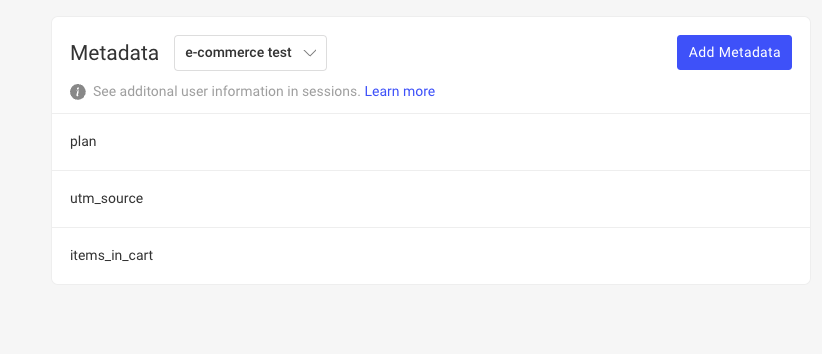
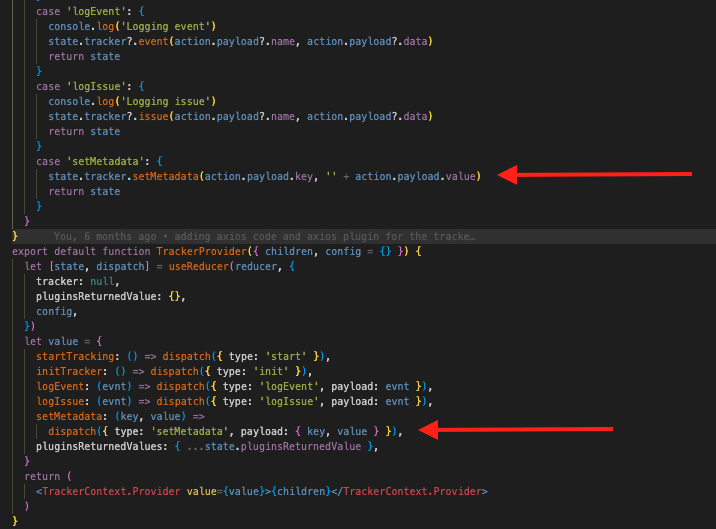
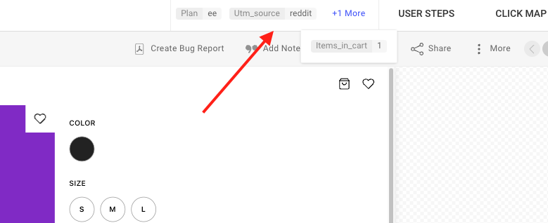
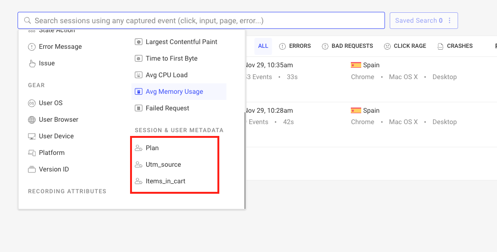
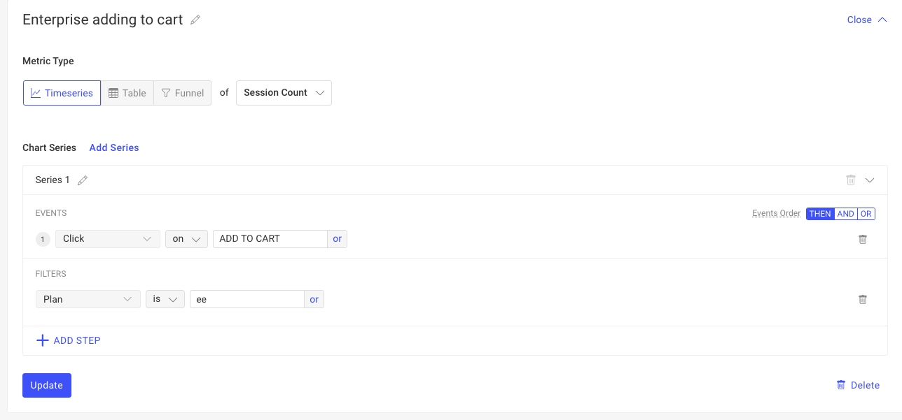
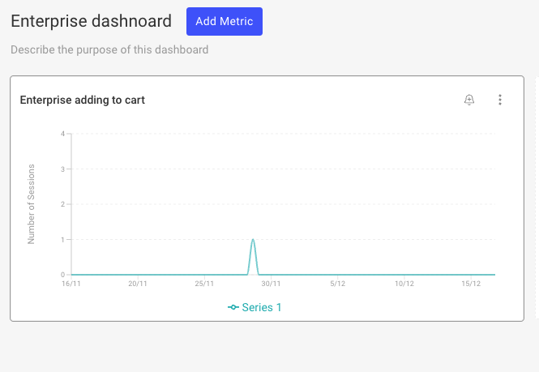

By default, our tracker will send a lot of useful information to our platform, but all that information is standard. As long as a data point is part of the Web API, chances are, we’re tracking it.

But what happens if you also want to enhance your session recordings with data specific to your application?

Like understanding which paid plan your user is under when you’re reviewing their replay? This information can provide additional context for your developers, so just because it’s not standard doesn’t mean we should ignore it, does it?

This  is where metadata comes into play.

**Note** that there is a [video version of this tutorial](https://www.youtube.com/watch?v=ITcJCeKWQGU) on our YouTube channel. So feel free to check that  out if you’re more of a visual learner.

## What is metadata?

In the context of a session replay, metadata is all the information your user does not generate, but that somehow relates to that user.

In other words, if the user clicks on a specific link, or performs a particular action, that’s not metadata, that’s a custom event (check out [the docs about Custom Events](/installation/custom-events) if you want to know more about them).

But if there is a flag that tells you a user is under the free plan, or the paid one. Or perhaps a tracking code showing you where that user came from? Those are all metadata and you can easily add them to your sessions.

## How to add metadata to a session?

The first thing to do is to set up the metadata fields directly in the platform. 

If you skip this step, you won’t be able to record any information, so don’t skip it!

To do that, you’ll go to your project’s configuration page by clicking on the top right cog on the top menu:



Once in there, click on the Metadata menu item on the far left of your screen:



That’ll take you to the metadata configuration screen. Make sure you select the right project from the dropdown and create as many fields as you need.



For this example, we’ve created 3 fields for the “e-commerce test” project:

- The “plan” that will contain the current plan of the user.
- The “utm_source” containing a code identifying where the user is coming from.
- And finally, the “items_in_cart” contains the total number of items in the user’s cart.

The last one is a piece of data that depends on user action, which is different from what we recommend. However, in this example, you’ll see the limitations of metadata fields and why this particular piece of information should’ve been a custom event instead.

With this setup ready, the next step is to add the required code to actually send the data as part of your session.

### Adding the code to send metadata

To add the metadata to the session we’ll use the `setMetadata` method from the tracker. You can use this method anytime throughout the user session, just keep in mind the following two considerations:

1. If you apply multiple values to the same metadata field, only the last one will be saved as part of the session.
2. All values must be strings. Otherwise, they won’t be saved. The tracker will not cast the values to strings, so be careful about this.

For this example, we’re using the e-commerce site built with Next.js we used for the tutorial on NextJs, make sure to [check that one out to](https://docs.openreplay.com/tutorials/next) understand the underlying architecture of the context provider shown in the following screenshot:



The red arrows show where the relevant updates were made. This context provider exports a  function called `setMetadata` which in turn, calls the `setMetadata` method from the tracker.

If you want a working example, you can check out [this repository](https://github.com/deleteman/nextjs-commerce-example/tree/redux_metadata/site).     

Now all we have to do, is use the exported function whenever we want to configure the metadata fields.

### Setting the metadata from our code

For the purpose of this example, we’re going to decide to set the `utm_source` and the `plan` fields directly from the homepage, and then whenever the user adds an item to the cart, we’ll update the last remaining field.

Again, if you want to know how to instantiate this tracker, please [review the original tutorial](https://www.notion.so/do-openreplay-com-frontend-changes-are-not-showing-1337470f75f144cc96cf8ceadbc70389) where we cover everything in detail.

On the `pages/index.tsx` file, we’re going to add the following code:

```jsx
// inside the main component
const { startTracking, setMetadata } = useContext(TrackerContext)
//...
useEffect(() => {
    async function getProds() {
      await startTracking()
      setMetadata('plan', getPlan()) //addition 
      setMetadata('utm_source', getUTMSource()) //addition
      dispatch(getMakeUpProducts() as any)
    }

    getProds()
  }, [dispatch])
```

Most of that hook was already there, but we added the reference to the `setMetadata` function and then the two calls to it. Both functions, `getPlan` and `getUTMSource`, return random data for this example. For your particular use case, you’ll have to implement them accordingly.

This code with set these metadata values when the homepage loads.

Now we need to add the last value,the number of items in the cart. For that, we’ll go to the `ProductSidebar` component, which is the one in charge of controlling what happens when we click on “Add to cart”, and we’ll add another hook to react to a change in the number of cart items.

```jsx
useEffect(() => {
    setMetadata('items_in_cart', productsInCart)
  }, [productsInCart])
```

Of course, you also have to get the `setMetadata` function from the context provider like before, but once you do that, you’re done.

Now the data is being saved. We can also see this on the platform through the list of sessions.

## Using the metadata

Now that you have the metadata being saved inside all session replays, what can you do with it?

Well, to start with, you can visualize it directly from the replay:



You should start seeing the metadata fields on the top right corner of your player screen. In this example, we see the user has an Enterprise Edition plan, they’re is coming from Reddit, and they have9 only one item added to the cart.

### Searching by metadata fields

The other powerful thing you can do with metadata is to use it as a search parameter. Using the omnisearch bar, you can select the custom metadata fields you created as search parameters:



So if you want to look at only Enterprise Edition replays, you can simply select the Plan field and filter it by “ee”, like so:


You can also use the same omnisearch bar when creating a widget for your dashboard. So to continue with the EE example, if you wanted to create a dashboard only for Enterprise customers, you could filter each custom widget using the “Plan” attribute.

For example, the following widget shows how many Enterprise customers are clicking on the “Add to cart” button:



Resulting in a widget that looks like this:



With metadata fields you can customize and extend the insights you get from your session replays as much as you want.

---

Metadata can significantly enhance the insights you can get from your session replays, and setting them up is relatively easy.

Remember that whatever information you want to save, it always has to be in the form of strings, otherwise they’ll be ignored.

The full source code for the [sample project using metadata can be seen here](https://github.com/deleteman/nextjs-commerce-example/tree/redux_metadata/site).

If you have any issues with any of the steps of this process, please contact us on our [Slack community](https://slack.openreplay.com/) and ask our devs directly!