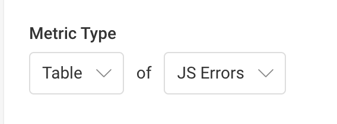
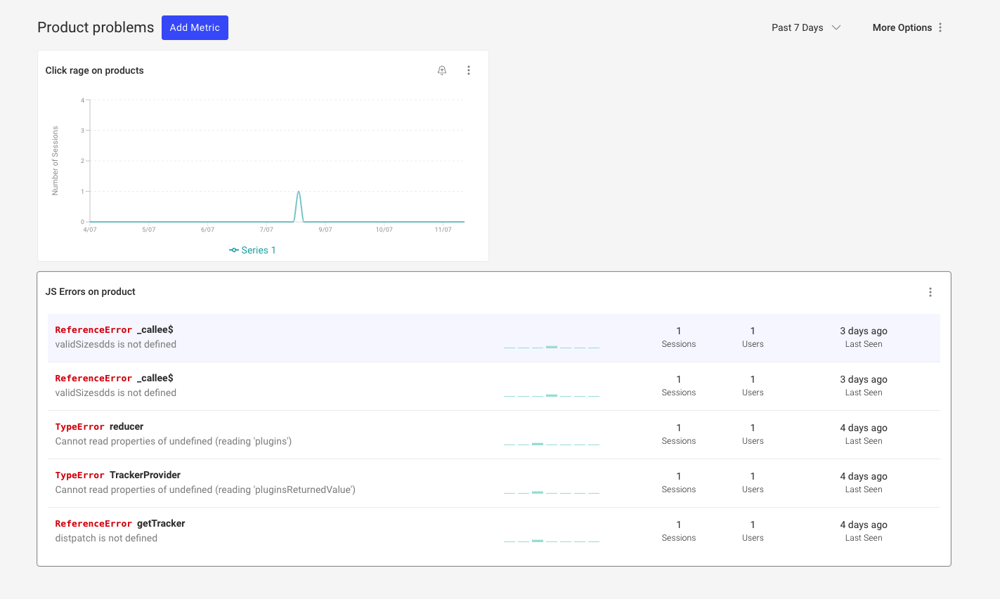

As of [version 1.7.0](https://github.com/openreplay/openreplay/releases/tag/v1.7.0), OpenReplay allows you to add your custom metrics into your own dashboards. This level of flexibility allows you to monitor your application from any perspective you and your team (since dashboards can be shared amongst members of your team) need.

At the same time, as part of this new release, you can create a custom metric where you list all JavaScript errors tracked during a session. 

So today we’re going to explore that metric.

## Catching JavaScript errors with the tracker

JavaScript errors are catched automatically by our tracker, so you don’t really have to worry about anything.

All exceptions that show up on the dev console during a real session, will be tracked inside the “Exceptions” tab of the replay.

We can use that information to create a metric around it, so let’s check that out.

## Creating a custom metric with your JavaScript errors

Follow these steps to create your custom metric. Once the metric is ready, we’ll create a custom dashboard with it inside.

1. Go to the Dashboards section on the top nav bar.
2. Click on “Metrics” on the left side menu.
3. Then click on “Create metric”
4. Give your Metric a name, let’s say “JavaScript errors”.
5. On Metric Type, select “Table”, and then “JS Errors”

Alternatively, you can also filter the sessions that have JS Errors. For example, we could make this metric the “**List of JS Errors for the Product Page**”. So you could add a filter based on the Path, like this:

For our sample application, product pages are under the path `/es/product/[SLUG]` so making the filter to “**start with**” `/es/product` we’ll only take into account JS errors that happen inside this page.

Additionally, and to keep the dashboard interesting, you could create another metric that would keep track of “Rage clicks” inside the same page. This is a metric that shows moments in which the user clicks multiple times on the same spot for no apparent reason.

A metric set up like this would do the trick:

Counting sessions, filtered by URL and making sure they have the “Click Rage” type of issue detected inside them.

After you’ve set up the filters and the metric itself, you can simply click on “Create”.

### Creating your dashboard

With the metric ready, you can click on the “**+Create**” link on the left menu (inside the Dashboards section).

Once the “Create Dashboard” modal appears, give it a name, then:

1. Click on the “Custom” category.
2. Select the new metrics we just created. 
3. Click on the “Create” button on the lower left button.

That should create a dashboard that shows you the issues found on the product page:

And if you need more details, you can click on the “**Click rage on products**” chart to see the list of sessions that have this problem.

And if you click on one of the rows of the “**JS Errors on product”** listing, you’ll get extra details about the problem:

You get the stacktrace of the error, along with extra information about the last sessions affected by it. In this case, we’re dealing with a typo in the name of a variable, but it could be any JS exception.

And that’s it, you’ve successfully created a new dashboard using your own custom metrics. Now go on and define the metrics you need for your own application.

If you’d like to read more details about the built-in metrics provided by OpenReplay, please check out [this other tutorial here](https://docs.openreplay.com/tutorials/custom-dashboard).

## Do you have questions?

If you have any issues with creating a custom dashboard in you project, please contact us on our [Slack community](https://slack.openreplay.com/) and ask our devs directly!