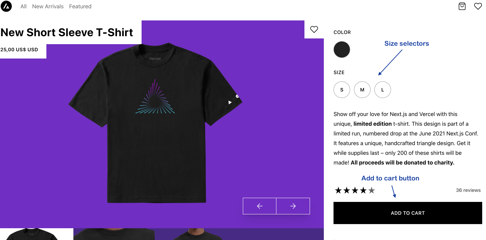
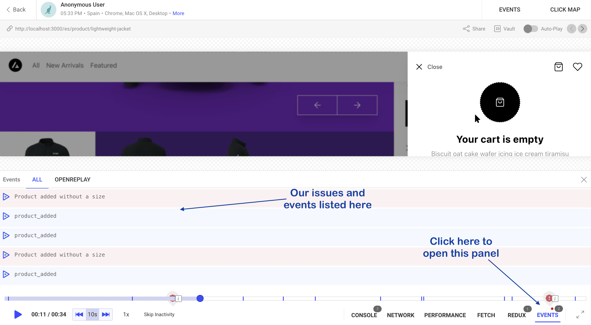

Custom events are a straightforward yet powerful concept that our Tracker provides without having to add anything extra.
They can extend the tracked data with whatever else you need, be it custom errors related to your business logic or even simple events, to be aware of what your users are doing.

Our tracker, by default, will keep tabs on many different things, including some [useful errors](https://docs.openreplay.com/tutorials/issues), but they might not be enough for you, which is why we have custom events.

## Adding custom events

For this example, let’s take a generic e-commerce site and  add some events to understand when our user adds a product to the shopping cart.

By default, OpenReplay will not track that information. However, through custom events, you can easily keep track of this.

For this tutorial, we’ll use a Next.js project set up following the same architecture as in the [Next.js tutorial](https://docs.openreplay.com/tutorials/next), so feel free to check it out if you haven’t.

### Creating the Tracker Provider

The logic inside this file is fully explained in [this tutorial](https://docs.openreplay.com/tutorials/next).

All you need to know now, is that this is a context provider we’re creating that will allow you to interact with the tracker through multiple functions.

In particular, we’re going to care about `logIssue` and `logEvent` which allow you to send a custom issue or event down to the platform.

- **Events** are meant to log user-specific actions. In our, case for instance, we’ll log the addition of a product into the cart.
- **Issues**, on the other hand, are meant to log errors that our tracker does not automatically pick up. In our case, we’ll simulate a networking error preventing us from accessing a 3rd party API. When that happens, we’ll log an issue on the platform.

```jsx
import { createContext, useCallback } from 'react'
import Tracker from '@openreplay/tracker'
import { v4 as uuidV4 } from 'uuid'
import { useReducer } from 'react'

export const TrackerContext = createContext()
function defaultGetUserId() {
  return uuidV4()
}
function newTracker(config) {
  const getUserId =
    config?.userIdEnabled && config?.getUserId
      ? config.getUserId
      : defaultGetUserId
  let userId = null
  const trackerConfig = {
    projectKey:
      config?.projectKey || process.env.NEXT_PUBLIC_OPENREPLAY_PROJECT_KEY,
 
  }
  if (config?.ingestPoint || process.env.NEXT_PUBLIC_OPENREPLAY_INGEST_POINT) {
    trackerConfig.ingestPoint =
      config?.ingestPoint || process.env.NEXT_PUBLIC_OPENREPLAY_INGEST_POINT
  }

  console.log('Tracker configuration: ')
  console.log(trackerConfig)
  const tracker = new Tracker(trackerConfig)
  if (config?.userIdEnabled) {
    userId = getUserId()
    tracker.setUserID(userId)
  }
  return tracker
}
function reducer(state, action) {
  switch (action.type) {
    case 'init': {
      if (!state.tracker) {
        console.log('Instantiaing the tracker for the first time...')
        let t = newTracker(state.config)
        let pluginsReturnedValue = {}
        if (state.config.plugins) {
          state.config.plugins.forEach((p) => {
            console.log('Using plugin...')
            pluginsReturnedValue[p.name] = t.use(p.fn(p.config))
          })
        }
        return {
          ...state,
          pluginsReturnedValue: pluginsReturnedValue,
          tracker: t,
        }
      }
      return state
    }
    case 'start': {
      console.log('Starting tracker...')
      state.tracker.start()
      return state
    }
    case 'logEvent': {
      console.log('Logging event')
      state.tracker?.event(action.payload?.name, action.payload?.data)
      return state
    }
    case 'logIssue': {
      console.log('Logging issue')
      state.tracker?.issue(action.payload?.name, action.payload?.data)
      return state
    }
  }
}
export default function TrackerProvider({ children, config = {} }) {
  let [state, dispatch] = useReducer(reducer, {
    tracker: null,
    pluginsReturnedValue: {},
    config,
  })
  let value = {
    startTracking: () => dispatch({ type: 'start' }),
    initTracker: () => dispatch({ type: 'init' }),
    logEvent: (evnt) => dispatch({ type: 'logEvent', payload: evnt }),
    logIssue: (evnt) => dispatch({ type: 'logIssue', payload: evnt }),
    pluginsReturnedValues: { ...state.pluginsReturnedValue },
  }
  return (
    <TrackerContext.Provider value={value}>{children}</TrackerContext.Provider>
  )
}
```

The `logEvent` and `logIssue` functions have the same signature, we’ll pass an object with `name` and `data` properties. The `name` will be used to identify our record in OpenReplay’s UI and the `data` will contain the information logged.

**Remember**: the `data` property must contain a serializable object. 

We can then set up this provider in our `_app.tsx` file like this:

```jsx

//imports here...

export default function MyApp({ Component, pageProps }: AppProps) {
  const Layout = (Component as any).Layout || Noop

  useEffect(() => {
    document.body.classList?.remove('loading')
  }, [])

  return (
    <TrackerProvider config={{}}>
      <Head />
      <ManagedUIContext>
        <Layout pageProps={pageProps}>
          <Component {...pageProps} />
        </Layout>
      </ManagedUIContext>
    </TrackerProvider>
  )
}
```

With that out of the way, we can now move on to trigger the events. 

### Logging custom issues and events

For this, we’ll take advantage of our UI:



We’ll record a new event every time the user adds a product to our cart (essentially when they hit the “ADD TO CART” button).

And we’ll log an issue, if they do so without selecting a size first.

You can check out the complete source code of this component [right here](https://github.com/deleteman/nextjs-commerce-example/blob/redux-store/site/components/product/ProductSidebar/ProductSidebar.tsx), but let’s focus on the logic we’ll add.

At the start of our component we’ll use the useContext hook:

```jsx
//outside the component
import { TrackerContext } from '../../../context/trackerProvider'

//inside the component
const { logEvent, logIssue } = useContext(TrackerContext)
```

 Inside the  `addToCart` function, we’ll add the following logic to check if there is no valid size selected:

```jsx
const validSizes = product.options
      .filter((o) => o.id == 'option-size')
      .map((o) => o.values)[0]

    let pickedSized = validSizes.find((s) => {
      return selectedOptions.size == s.label.toLowerCase()
    })

    if (!pickedSized) {
      logIssue({
        name: 'Product added without a size',
        data: {
          product_id: product.id,
          added_date: new Date(),
          available_options: validSizes,
        },
      })
    }
```

The key part of the code, is the last `IF`, when we realize there is no valid size selected, we call the `logIssue` function, which we got from the `useContext` call from before.

And for the even, we’ll go deeper into the same function and we’ll add:

```jsx
logEvent({
        name: 'product_added',
        data: {
          id: product.id,
          date_added: new Date(),
        },
      })
```

That’s all we need, we can then go to OpenReplay, find our session recording, and inspect the Events section:



And if we want the details, we can click on the “DETAILS” link that appears when you hover over one of the rows:


Those are the details we recorded when adding a product.

Remember to [check out the full Next.js tutorial](https://docs.openreplay.com/tutorials/next) if this is the first time you’re using OpenReplay with this framework.

And if you’d like to review the full source code of this example, [you can find it here](https://github.com/deleteman/nextjs-commerce-example/tree/redux-store).

## Do you have questions?

If you have any issues with custom events in you project, please contact us on our [Slack community](https://slack.openreplay.com/) and ask our devs directly!