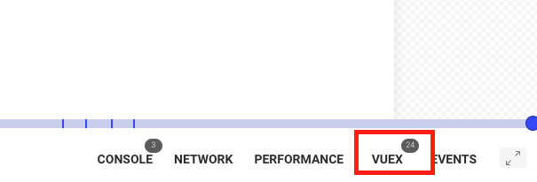

Pinia is the replacement state management library for Vue projects. Where you used to use VueX, now you’ll be using Pinia.

With our [Pinia plugin](/plugins/pinia), you can keep track of the state changes throughout the life cycle of your application.

** Note **
If you'd like to watch a video version of this tutorial, you have one available [here](https://youtu.be/0TE5dfzz4-c)

## Installing the plugin

The plugin can easily be installed with the following command:

```jsx
npm i @openreplay/tracker-vuex
```

## Using the plugin from inside your Vue app

For this example, we will be using a sample Vue application to showcase how you can add and interact with this plugin inside a real app.

**Note**: the full source code of this example is located in this [GitHub repo](https://github.com/deleteman/openreplay-vue-pinia-example), check it out if you need more details.

After installing the plugin, we’ll modify the `main.js` file by adding the import statement below:

```jsx
import trackerVuex from '@openreplay/tracker-vuex/cjs';
```

And then, we’ll use the `startTracker` function to instantiate the tracker, and use the plugin all at once. 

The result of calling this function will be an object containing the results of using the `use` method with the plugin. 

**Note** how the name of the destructured property is the same as the value of the `name` property. As  long as you keep those two the same, you’re fine.

```jsx
const {piniaPlugin} = startTracker({
    projectKey: "<your project key>",
    plugins: [{
        name: 'piniaPlugin',
        fn: trackerVuex
    }]
})
```

The next thing is to create a named store wrapper which we’ll use to set the plugin up on the desired store later on.

```jsx
const piniaStoreWrapper = piniaPlugin("products")
saveStore(piniaStoreWrapper)
```

The `piniaStoreWrapper` will later have to be used with the store we decide to track. However, the store is not yet created at this point in time, so we’ll save it through the `saveStore` function.

### Utility functions

Before moving forward, let’s look at the `saveStore` and `startTracker` functions.

The first one is part of the `storesManager` module, which looks like this:

```jsx
let storeWrapper = null;

export function saveStore(s) {
    storeWrapper = s;
}

export function getStore(store) {
    return storeWrapper;
}
```

This module will let us use the `piniaStoreWrapper` we created before, somewhere else.

As for the `startTracker` function, the code looks like this:

```jsx
export function startTracker(config) {
    console.log("Starting tracker...")

    console.log("Project key used: ", config.projectKey)
    const trackerConfig = {
        projectKey: config.projectKey,
         //ingestPoint: config.ingestPoint,
        __DISABLE_SECURE_MODE: true
    }

    const tracker = new Tracker(trackerConfig);

    const pluginReturns = {}
    config?.plugins.forEach( p => {
        console.log("Using plugin...", p.name)
        pluginReturns[p.name] = tracker.use(p.fn())
    })
 
    tracker.start();
    return {
        tracker,
        ...pluginReturns
    }
}
```

This function instantiates the tracker with the configuration we give it. Notice how I’ve left the `ingestPoint` option commented out, that’s because we’re dealing directly with the SaaS version, but if you’re looking to use this code with a self-hosted version, you’ll have to specify it, and it should look like something similar to this: `<your-instance>.yourhost/ingest`

### Tracking your Pinia stores

Once all the setup code is ready, go to the place where you’re using the store, in the case of our example, let’s edit the  `App.vue` file to call the `getStore` function, which will return the store wrapper we saved before.

And we’ll use it to wrap the store we want to track:

```jsx
<template>
  <!-- template code -->
</template>

<script lang="ts">
import { computed, defineComponent, onMounted, ref } from 'vue'
import { Product, useProductStore } from './store/products'
import { useCartStore } from './store/cart'
import {getStore} from './store/storesManager.js'

export default defineComponent({
  setup() {
   
    const productStore = useProductStore()
    const loading = ref(true)
    //we get the wrapper here
	  const storeWrapper = getStore()

    onMounted(async () => {
      await productStore.fetchAll()
      loading.value = false
    })

    const cartStore = useCartStore()

		//we wrap the cart store here
    storeWrapper(cartStore)
    return {
      products: computed(() => productStore.list),
      cart: computed(() => cartStore.formattedCart),
      total: computed(() => cartStore.total),
      loading,
      add: (product: Product) => cartStore.add(product),
      remove: (product: Product) => cartStore.remove(product),
    }
  }
})

</script>
```

## Watching the state on the replay

To review the state changes during the replay, click on the new VueX tab in the lower right corner:



When clicking on it, you’ll see the content of the store, and you’ll be able to understand how it changes and the data saved within it:


Notice the name of the store, it’s the name we used when calling the Pinia plugin  the first time around.

---

You can [check out this repository](https://github.com/deleteman/openreplay-vue-pinia-example) for the **complete source code** of a working Pinia/Vue application with the Pinia plugin.

If you have any issues setting up the Pinia plugin on your project, please contact us on our [Slack community](https://slack.openreplay.com/) and ask our devs directly!