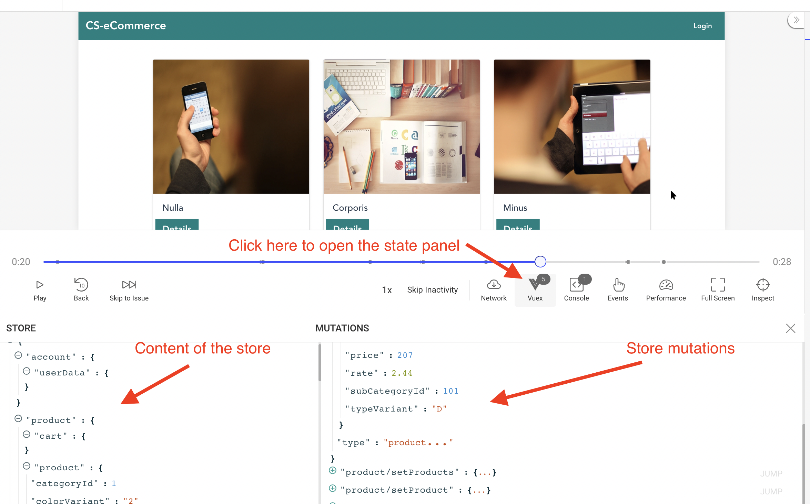

If you’re using VueX to manage the state of your Vue-based apps, then integrating [OpenReplay’s plugin](https://docs.openreplay.com/plugins/vuex) to track the state updates is very simple.

If you’d like to follow along, use [the code published](https://github.com/deleteman/openreplay-vuex-example) here.

## Integrating the Tracker into your code

The first thing we need to worry about is integrating OpenReplay’s tracker into the project.

We’re dealing with a Vue-based project, which means our entry point will be the `main.js` file.

First install the tracker with:

```tsx
yarn add @openreplay/tracker
```

Or use npm if you prefer:

```tsx
npm install @openreplay/tracker
```

With that out of the way, once you’ve set up the project inside the platform, get the project KEY and save it inside a `.env` file located at the project's root.

```bash
VUE_APP_OPENREPLAY_PROJECT_KEY=<your project key here>
```

Notice the name of the env variable. It starts with `VUE_APP_`  because when we do that, WebPack will replace its value wherever we use the code `process.env.VUE_APP_OPENREPLAY_PROJECT_KEY` to keep us from having to ship the actual configuration file to the client.

Now, inside your `src` folder, create a `tracker` folder and an `index.js` file inside it. This file will export a single function: `startTracker`  which will configure everything and get the tracker started.

```jsx
import Tracker from '@openreplay/tracker';

import {v4 as uuidV4} from 'uuid'

function defaultGetUserId() {
   return uuidV4() 
}

export function startTracker(config) {

    console.log("Starting tracker...")

    const getUserId = (config?.userIdEnabled && config?.getUserId) ? config.getUserId : defaultGetUserId
    let userId = null;

    const trackerConfig = {
        projectKey: config.projectKey
    }

    const tracker = new Tracker(trackerConfig);

    const pluginReturns = {}
    Object.keys(config?.plugins).forEach( pk => {
        pluginReturns[pk] = tracker.use(config?.plugins[pk]())
    })
 
    if(config?.userIdEnabled) {
        userId = getUserId()
        tracker.setUserID(userId)
    }
    console.log("tracker: user id: ", userId)

    tracker.start();
    return {
        tracker,
        userId,
        ...pluginReturns
    }
}
```

What you have to worry about now is that this function is doing everything you need. All you have to do is to pass the project key when calling it. Like this (from the `main.js` file):

```jsx
import {startTracker} from './tracker/index'

let {vuexTracker} = startTracker({
    projectKey: process.env.VUE_APP_OPENREPLAY_PROJECT_KEY,
})
```

As we’ve already seen, the line `process.env.VUE_APP_OPENREPLAY_PROJECT_KEY` will be replaced by your actual project key when rendering the page.

Now, let’s add the VueX plugin so we can also start tracking state changes.

## Adding the VueX plugin

The plugin is easily installed with a single line:

```jsx
yarn add @openreplay/tracker-vuex
```

After that, we can import it into our code, and pass it as part of the configuration object to the `startTracker` function.

Go back to the definition of that function, and notice how we already have code to handle plugins. In fact, the `plugins` element of the configuration is a map that receives the plugins (with a key of our choice) and returns whatever we get back from calling the `use` method, also, on the same key we used for the plugin.

Let me show you, this is again, on the `main.js` file:

```jsx
//your other imports go here...
import trackerVuex from '@openreplay/tracker-vuex';
import store from './store'

let {vuexTracker} = startTracker({
    userIdEnabled: true,
    projectKey: process.env.VUE_APP_OPENREPLAY_PROJECT_KEY,
    plugins:{
      'vuexTracker': trackerVuex
    } 
})

new Vue({
  router,
  store: store([vuexTracker]),
  render: h => h(App)
}).$mount('#app')
```

Notice how we’re:

1. Calling the `startTracker` function with the `plugins` map. The string “vuexTracker” is something I came up with at the time, but you can use any string here.
2. We’re destructuring the response and getting the key “vuexTracker” (the same key we used for the map). As long as these two keys match, you can use any string.
3. We’re passing the `vuexTracker` function as a parameter to the `store` function.

The vuexTracker variable essentially contains our VueX plugin, this plugin will be hooked into the VueX store and for that we use the following code:

```jsx
import Vue from 'vue'
import Vuex from 'vuex'

import account from './account'
import product from './product'

Vue.use(Vuex)

export default function (plugins = []) {
  return function() {
    const Store = new Vuex.Store({
      modules: {
        account,
        product
      },

      strict: process.env.DEV,
      plugins
    })

    return Store
  }
}
```

The above snippet is your standard code for setting up a store, we just added the ability to configure plugins to make sure we can track what happens to the state in our application.

Once this is ready, you should see a new VueX option inside the session replays, like this:



## Do you have questions?

You can [check out this repository](https://github.com/deleteman/openreplay-vuex-example) for the **complete source code** of a working application using VueX with the Tracker.

If you have any issues setting up the Tracker or the VueX plugin on you project, please contact us on our [Slack community](https://slack.openreplay.com/) and ask our devs directly!