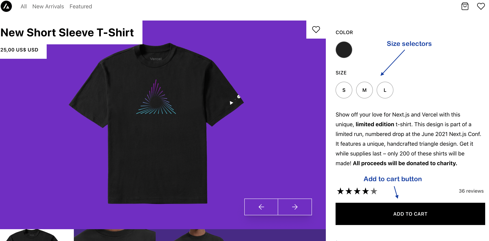
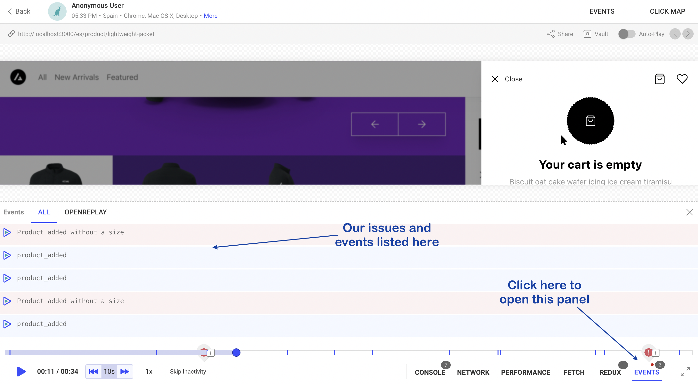

الأحداث المخصصة هي مفهوم بسيط ولكنه قوي يوفره أداة التتبع (Tracker) لدينا دون الحاجة إلى إضافة أي شيء إضافي.
يمكنها توسيع البيانات المتتبَّعة بأي شيء آخر تحتاج إليه، سواء كانت أخطاء مخصصة متعلقة بمنطق عملك أو حتى أحداثًا بسيطة، لتكون على دراية بما يفعله مستخدموك.

ستراقب أداة التتبع لدينا، بشكل افتراضي، العديد من الأشياء المختلفة، بما في ذلك بعض [الأخطاء المفيدة](https://docs.openreplay.com/tutorials/issues)، لكنها قد لا تكون كافية لك، ولهذا السبب لدينا الأحداث المخصصة.

## إضافة الأحداث المخصصة

في هذا المثال، لنأخذ موقع تجارة إلكترونية عامًا ونضيف بعض الأحداث لفهم متى يضيف مستخدمنا منتجًا إلى عربة التسوق.

بشكل افتراضي، لن يتتبع OpenReplay تلك المعلومات. ومع ذلك، من خلال الأحداث المخصصة، يمكنك بسهولة تتبع ذلك.

في هذا الدرس التعليمي، سنستخدم مشروع Next.js تم إعداده باتباع البنية نفسها كما في [درس Next.js التعليمي](https://docs.openreplay.com/tutorials/next)، لذا لا تتردد في الاطلاع عليه إذا لم تفعل ذلك بعد.

### إنشاء Tracker Provider

تم شرح المنطق داخل هذا الملف بالكامل في [هذا الدرس التعليمي](https://docs.openreplay.com/tutorials/next).

كل ما تحتاج إلى معرفته الآن هو أن هذا مزوّد سياق (context provider) نقوم بإنشائه، وسيسمح لك بالتفاعل مع أداة التتبع من خلال عدة دوال.

على وجه الخصوص، سنهتم بـ `logIssue` و`logEvent`، اللذين يسمحان لك بإرسال مشكلة أو حدث مخصص إلى المنصة.

- **الأحداث (Events)** مخصصة لتسجيل الإجراءات الخاصة بالمستخدم. في حالتنا على سبيل المثال، سنسجل إضافة منتج إلى العربة.
- **المشكلات (Issues)**، من ناحية أخرى، مخصصة لتسجيل الأخطاء التي لا تلتقطها أداة التتبع لدينا تلقائيًا. في حالتنا، سنحاكي خطأ شبكة يمنعنا من الوصول إلى واجهة برمجة تطبيقات تابعة لطرف ثالث. وعندما يحدث ذلك، سنسجل مشكلة على المنصة.

```jsx
import { createContext, useCallback } from 'react'
import Tracker from '@openreplay/tracker'
import { v4 as uuidV4 } from 'uuid'
import { useReducer } from 'react'

export const TrackerContext = createContext()
function defaultGetUserId() {
  return uuidV4()
}
function newTracker(config) {
  const getUserId =
    config?.userIdEnabled && config?.getUserId
      ? config.getUserId
      : defaultGetUserId
  let userId = null
  const trackerConfig = {
    projectKey:
      config?.projectKey || process.env.NEXT_PUBLIC_OPENREPLAY_PROJECT_KEY,
 
  }
  if (config?.ingestPoint || process.env.NEXT_PUBLIC_OPENREPLAY_INGEST_POINT) {
    trackerConfig.ingestPoint =
      config?.ingestPoint || process.env.NEXT_PUBLIC_OPENREPLAY_INGEST_POINT
  }

  console.log('Tracker configuration: ')
  console.log(trackerConfig)
  const tracker = new Tracker(trackerConfig)
  if (config?.userIdEnabled) {
    userId = getUserId()
    tracker.setUserID(userId)
  }
  return tracker
}
function reducer(state, action) {
  switch (action.type) {
    case 'init': {
      if (!state.tracker) {
        console.log('Instantiaing the tracker for the first time...')
        let t = newTracker(state.config)
        let pluginsReturnedValue = {}
        if (state.config.plugins) {
          state.config.plugins.forEach((p) => {
            console.log('Using plugin...')
            pluginsReturnedValue[p.name] = t.use(p.fn(p.config))
          })
        }
        return {
          ...state,
          pluginsReturnedValue: pluginsReturnedValue,
          tracker: t,
        }
      }
      return state
    }
    case 'start': {
      console.log('Starting tracker...')
      state.tracker.start()
      return state
    }
    case 'logEvent': {
      console.log('Logging event')
      state.tracker?.event(action.payload?.name, action.payload?.data)
      return state
    }
    case 'logIssue': {
      console.log('Logging issue')
      state.tracker?.issue(action.payload?.name, action.payload?.data)
      return state
    }
  }
}
export default function TrackerProvider({ children, config = {} }) {
  let [state, dispatch] = useReducer(reducer, {
    tracker: null,
    pluginsReturnedValue: {},
    config,
  })
  let value = {
    startTracking: () => dispatch({ type: 'start' }),
    initTracker: () => dispatch({ type: 'init' }),
    logEvent: (evnt) => dispatch({ type: 'logEvent', payload: evnt }),
    logIssue: (evnt) => dispatch({ type: 'logIssue', payload: evnt }),
    pluginsReturnedValues: { ...state.pluginsReturnedValue },
  }
  return (
    <TrackerContext.Provider value={value}>{children}</TrackerContext.Provider>
  )
}
```

تمتلك الدالتان `logEvent` و`logIssue` التوقيع نفسه، حيث سنمرر كائنًا يحتوي على الخاصيتين `name` و`data`. سيُستخدم `name` لتحديد سجلّنا في واجهة مستخدم OpenReplay، وسيحتوي `data` على المعلومات المسجَّلة.

**تذكّر**: يجب أن تحتوي الخاصية `data` على كائن قابل للتسلسل (serializable). 

يمكننا بعد ذلك إعداد هذا المزوّد في ملف `_app.tsx` لدينا بهذا الشكل:

```jsx

//imports here...

export default function MyApp({ Component, pageProps }: AppProps) {
  const Layout = (Component as any).Layout || Noop

  useEffect(() => {
    document.body.classList?.remove('loading')
  }, [])

  return (
    <TrackerProvider config={{}}>
      <Head />
      <ManagedUIContext>
        <Layout pageProps={pageProps}>
          <Component {...pageProps} />
        </Layout>
      </ManagedUIContext>
    </TrackerProvider>
  )
}
```

بعد الانتهاء من ذلك، يمكننا الآن الانتقال إلى تشغيل الأحداث. 

### تسجيل المشكلات والأحداث المخصصة

لهذا الغرض، سنستفيد من واجهة المستخدم لدينا:



سنسجل حدثًا جديدًا في كل مرة يضيف فيها المستخدم منتجًا إلى عربتنا (أي عندما يضغط على زر “ADD TO CART”).

وسنسجل مشكلة إذا فعل ذلك دون اختيار مقاس أولًا.

يمكنك الاطلاع على الكود المصدري الكامل لهذا المكوّن [من هنا مباشرة](https://github.com/deleteman/nextjs-commerce-example/blob/redux-store/site/components/product/ProductSidebar/ProductSidebar.tsx)، لكن دعنا نركز على المنطق الذي سنضيفه.

في بداية المكوّن لدينا، سنستخدم الخطّاف (hook) useContext:

```jsx
//outside the component
import { TrackerContext } from '../../../context/trackerProvider'

//inside the component
const { logEvent, logIssue } = useContext(TrackerContext)
```

 داخل الدالة `addToCart`، سنضيف المنطق التالي للتحقق مما إذا لم يكن هناك مقاس صالح محدّد:

```jsx
const validSizes = product.options
      .filter((o) => o.id == 'option-size')
      .map((o) => o.values)[0]

    let pickedSized = validSizes.find((s) => {
      return selectedOptions.size == s.label.toLowerCase()
    })

    if (!pickedSized) {
      logIssue({
        name: 'Product added without a size',
        data: {
          product_id: product.id,
          added_date: new Date(),
          available_options: validSizes,
        },
      })
    }
```

الجزء الأساسي من الكود هو `IF` الأخير: عندما ندرك أنه لا يوجد مقاس صالح محدّد، نستدعي الدالة `logIssue`، التي حصلنا عليها من استدعاء `useContext` السابق.

أما بالنسبة للحدث، فسنتعمق أكثر في الدالة نفسها وسنضيف:

```jsx
logEvent({
        name: 'product_added',
        data: {
          id: product.id,
          date_added: new Date(),
        },
      })
```

هذا كل ما نحتاج إليه. يمكننا بعد ذلك الانتقال إلى OpenReplay، والعثور على تسجيل الجلسة الخاص بنا، وفحص قسم الأحداث (Events):



وإذا أردنا التفاصيل، يمكننا النقر على رابط “DETAILS” الذي يظهر عند تمرير المؤشر فوق أحد الصفوف:


تلك هي التفاصيل التي سجّلناها عند إضافة منتج.

تذكّر أن [تطّلع على درس Next.js التعليمي الكامل](https://docs.openreplay.com/tutorials/next) إذا كانت هذه هي المرة الأولى التي تستخدم فيها OpenReplay مع هذا الإطار.

وإذا كنت ترغب في مراجعة الكود المصدري الكامل لهذا المثال، [يمكنك العثور عليه هنا](https://github.com/deleteman/nextjs-commerce-example/tree/redux-store).

## هل لديك أسئلة؟

إذا واجهت أي مشكلات مع الأحداث المخصصة في مشروعك، يُرجى التواصل معنا عبر [مجتمعنا على Slack](https://slack.openreplay.com/) وطرح أسئلتك مباشرة على مطورينا!
