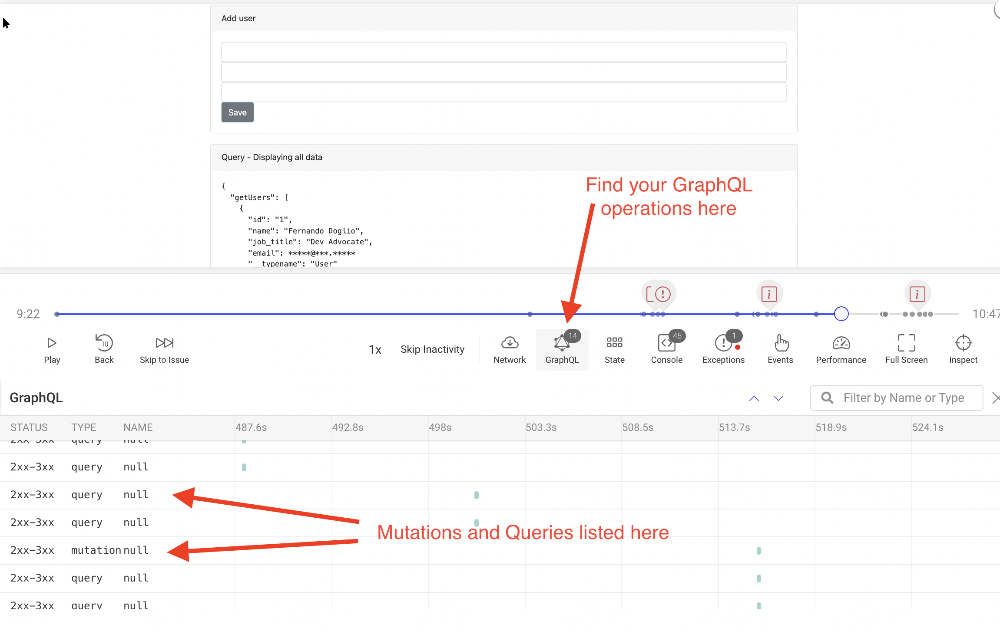
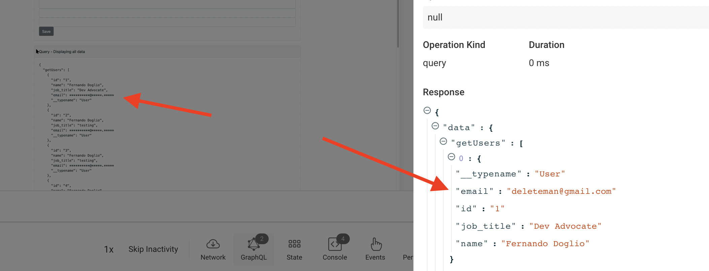
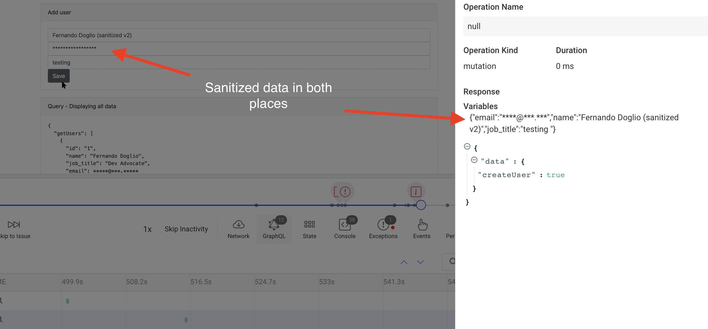

إذا كنت تستخدم GraphQL كلغة استعلام لواجهات API الخاصة بك من داخل تطبيقك، فإن [إضافة GraphQL](https://docs.openreplay.com/plugins/graphql) يمكن أن تساعدك في تتبّع كل من عمليات التعديل (mutations) والاستعلامات (queries) التي تُنفَّذ على خادم GraphQL الخاص بك.

في هذا الدرس التعليمي، سنستخدم عميل Apollo Boost، ولكن طالما أن العميل الذي تستخدمه يتيح لك إعداد نوع من الـ middleware، فستتمكن من استخدام الإضافة في شيفرتك.

إذا أردت المتابعة خطوة بخطوة، يمكنك [الاطّلاع على هذا المستودع](https://github.com/deleteman/openreplay-graphql-example) الذي يحتوي على كل من خادم GraphQL والتطبيق العميل. 

## إعداد المتعقّب (Tracker) أولًا

قبل تثبيت إضافة GraphQL، ستحتاج إلى أن يكون المتعقّب (Tracker) مثبّتًا. إذا كنت تعرف بالفعل كيفية القيام بذلك، فانتقل إلى القسم التالي، وإلا فتابع القراءة.

سنحفظ هذه الشيفرة داخل وحدة (module) منفصلة ستصدّر دالتين: `init` و `start`.

الدالة الأولى ستنشئ نسخة من المتعقّب وتُعدّ جميع الإضافات؛ أما الثانية فستستدعي فقط الطريقة `start`. 

```jsx
import OpenReplay from '@openreplay/tracker';

let _tracker = null;

export function init({plugins}) {

    _tracker = new OpenReplay({
        projectKey: process.env.OPENREPLAY_PROJECT_KEY
    });

    
    let pluginResults = {}
    if(plugins) {
        Object.keys(plugins).forEach( pk => {
            pluginResults[pk] = _tracker.use(plugins[pk]())
        })
    }
    return pluginResults
}

export function start() {
    return _tracker.start()
}
```

الأمر المثير للاهتمام بشأن دالة init هو أنها تُرجِع كائنًا مكوَّنًا من جميع القيم التي تُرجعها الإضافات. بعض إضافاتنا ستُرجع دالة سيتعيّن عليك استخدامها لاحقًا (كما في حالة إضافة GraphQL). يتيح لك هذا الأسلوب تهيئة المتعقّب بجميع الإضافات دفعة واحدة، ثم استخدام القيم المُرجَعة متى شئت.

## استخدام الإضافة

بعد تثبيت الإضافة باستخدام npm i @openreplay/tracker-graphql، استخدم الشيفرة التالية لاستدعاء دالة init التي عرّفناها للتو:

```jsx
import trackerGraphQL from '@openreplay/tracker-graphql';
import {init} from './tracker/index'

const {graphqlTracker} = init({
  plugins: { 
    graphqlTracker: trackerGraphQL
  }
})
```

يمكن أن يكون المفتاح `graphqlTracker` المستخدم هنا أي شيء تريده. وطالما أن المفتاح المستخدم داخل قسم `plugins` هو نفسه المفتاح الذي تستخرجه بالتفكيك (destructuring) من نتائج دالة `init`، فلن تواجه أي مشكلة.

## إعداد الإضافة مع عميل Apollo

في هذا الدرس التعليمي، سنستخدم مكتبة Apollo Boost، التي تتيح لك تعديل تدفّق بيانات كل طلب من خلال ما يُسمّونه “links”.

هذه الـ links تشبه دوال الـ middleware التي يمكنك استخدامها لاعتراض تدفّق بيانات الطلب، وفي حالتنا، لتسجيله.

ستُنشئ الشيفرة التالية link جديدًا باستخدام الدالة `ApolloLink`. سيلتقط هذا الـ link بيانات العملية ونتائجها، ويستدعي دالتنا `graphqlTracker` (تلك التي أرجعها استدعاء `init` أعلاه).

```jsx
const trackerApolloLink = new ApolloLink((operation, forward) => {

  const operationDefinition = operation.query.definitions[0];
  let {operationName, variables} = operation
  const {kind, operation: op} = operationDefinition
  const opKind = kind === 'OperationDefinition' ? op : 'unknown?'

  let results = forward(operation).map((result) => {
    return graphqlTracker(opKind, operationName, variables, result);
  });
  if(results.length === 0) { //if there are no results, then we've not tracked anything so far...
    graphqlTracker(opKind, operationName, variables, {});
  }
  return results
});
```

وبعد أن انتهينا من ذلك، يمكننا استخدام الـ link الذي أنشأناه حديثًا على النحو التالي:

```jsx
import {ApolloClient,  HttpLink } from 'apollo-boost';
import { ApolloProvider } from '@apollo/react-hooks';
import { InMemoryCache } from 'apollo-cache-inmemory';
import { ApolloLink, from } from '@apollo/client';

const link = from([
  trackerApolloLink,
  new HttpLink({uri: () => 'http://localhost:4000/graphql'}),
]);

const client = new ApolloClient({
  link,
  cache: new InMemoryCache()
});

ReactDOM.render(<ApolloProvider client={client}>
  <App />
</ApolloProvider>, document.getElementById('root'));
```

الشيفرة أعلاه مأخوذة من وثائق Apollo، وعند هذه المرحلة يكون المتعقّب والإضافة قد أُعِدّا بالفعل، لذا لا داعي حقًا للقلق بشأن أي شيء آخر.

بمجرد الانتهاء، ستُظهر عمليات إعادة التشغيل (replays) قسمًا جديدًا يسرد جميع عمليات GraphQL.



ومع ذلك، فإن المعلومات الحساسة التي يُنقّيها المتعقّب تلقائيًا (مثل عناوين البريد الإلكتروني) لن تُنقّيها الإضافة. لذا ستواجه مواقف كالتالي حيث يحتوي الـ DOM على البيانات المُنقّاة، بينما تُظهر تفاصيل العملية البيانات الفعلية.



في حين أن الإضافة نفسها لا توفّر أي دالة تنقية، لا يزال بإمكاننا إضافة شيفرة تخفي المعلومات الشخصية والخاصة من إعادة التشغيل للمساعدة في الحفاظ على خصوصية مستخدميك.

## تنقية البيانات المسجَّلة

إذا نظرت إلى مثال الشيفرة الذي أنشأت فيه الكائن trackerApolloLink، فسترى أن كل ما أفعله هو استدعاء دالة المتعقّب التي تحفظ المعلومات على المتعقّب.

إذا لم أغيّر البيانات، فسيُحفظ كل شيء دون تغيير. لذا، لتنقية البيانات في إعادة التشغيل **مع إبقاء العملية دون تغيير**، نحتاج إلى استنساخ المتغيرات الأساسية قبل استدعاء المتعقّب. وهذا يعني استنساخ المتغيرات والنتائج الخاصة بالعملية، وهذا كل ما نريده. 

إليك إذًا مقتطفًا من الشيفرة سيُنشئ ApolloLink ويُبقي البيانات سرية داخل بيانات إعادة التشغيل:

```jsx
/**
 * Sanitize the result from a GraphQL operation
 * @returns Returns the result object but with the sanitized fields changed.
 */
function sanitizeResult(res) {
  //deep clonning needs to happen to make sure this only affects the new object and not
  //the original object.
  let sanitized = JSON.parse(JSON.stringify(res))

  let ops = Object.keys(sanitized.data)
  ops.forEach( o => {
    if(Array.isArray(sanitized.data[o])) { //mutations don't really return arrays
      sanitized.data[o] = sanitized.data[o].map( sanitizeData )
    }
  })
  return sanitized
}

// We only want to hide the content of othe "email" field for now.
function sanitizeData(vars) {
  let newVars = {...vars}
  if(newVars.email) {
    newVars.email = "****@***.***"
  }
  return newVars
}

const trackerApolloLink = new ApolloLink((operation, forward) => {

  const operationDefinition = operation.query.definitions[0];
  let {operationName, variables} = operation
  const {kind, operation: op} = operationDefinition
  const opKind = kind === 'OperationDefinition' ? op : 'unknown?'

  let trackedVariables = sanitizeData({...variables})
  let results = forward(operation).map((result) => {
    let trackeresults = sanitizeResult(result)
    graphqlTracker(opKind, operationName, trackedVariables, trackeresults);
    return result //we have to return the original "result" object here, not the sanitized one
  });
  if(results.length === 0) { //if there are no results, then we've not tracked anything so far...
    graphqlTracker(opKind, operationName, trackedVariables, {});
  }
  return results
});
```

الجوانب الأساسية لهذه الشيفرة هي:

1. أضفنا دالتين، واحدة لتنقية الحقل `email` من كائن، وأخرى لتنقية نتائج عملية GraphQL.
2. داخل دالة رد النداء الخاصة بـ `map` (من دالة الـ link)، لم نعد الآن نُرجع المخرجات من graphqlTracker، لأن تلك الدالة ستُرجع قيمة النتيجة التي تلقّتها دون أي تغيير. 1. لكن تلك النتيجة ستُرجَع إلى التطبيق العميل، وإذا كنا نُنقّي النتيجة، فسيرى المستخدم النسخة المُنقّاة من مجموعة البيانات. وبدلًا من ذلك، نحتاج إلى استنساخ النتيجة لتعديل تلك التي يجري تتبّعها وإرجاع النسخة الأصلية.
3. تقوم الدالة `sanitizeResult` باستنساخ عميق للكائن، لأن تعديله بطريقة أخرى سيغيّر النتيجة نفسها.



## هل لديك أسئلة؟

يمكنك [الاطّلاع على هذا المستودع](https://github.com/deleteman/openreplay-graphql-example) للحصول على **الشيفرة المصدرية الكاملة** لتطبيق فعّال قائم على GraphQL مع المتعقّب.

إذا واجهت أي مشكلات في إعداد المتعقّب في مشروع GraphQL الخاص بك، فيرجى التواصل معنا عبر [مجتمعنا على Slack](https://slack.openreplay.com/) وطرح أسئلتك مباشرةً على مطوّرينا!