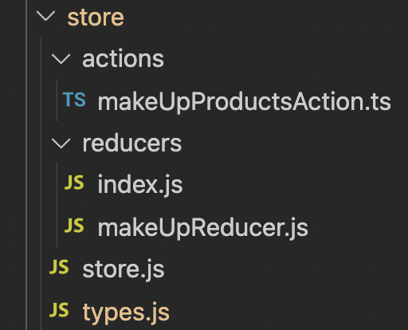

import Aside from '~/components/Aside.astro'
import YoutubeVideo from '~/components/YoutubeVideo.astro'

<YoutubeVideo title="شاهد كيفية تتبّع الحالة باستخدام Redux"
  description="إذا كنت لا تحب القراءة، يمكنك متابعة هذا الدرس المرئي الذي يوضّح لك كيفية تتبّع حالة تطبيقات React الخاصة بك عند استخدام Redux"
  videoURL="https://www.youtube.com/watch?v=vSg4_i-jCj0"
  />

إذا كنت بحاجة إلى رؤية إضافية عند إعادة تشغيل جلسات مستخدميك، فإن إلقاء نظرة على حالة التطبيق يمكن أن يكون مفيدًا للغاية.

في حالة Redux، يوفّر OpenReplay [إضافة](https://docs.openreplay.com/plugins/redux) تتيح لك الاندماج في الآلية الداخلية لعمل الـ store. ستمكّنك هذه الإضافة من رؤية حالة الـ store الخاص بـ Redux والإجراءات (actions) التي يتم إرسالها (dispatched) طوال الجلسة المسجّلة.

بمجرد الإعداد، ينبغي أن تكون قادرًا على مشاهدة التغييرات في الـ store كما هو موضّح في لقطة الشاشة التالية:


## إعداد Redux في مشروع Next.js

في هذا الدرس، سنستخدم [هذا المستودع](https://github.com/deleteman/nextjs-commerce-example/tree/redux-store) (الفرع **redux-store**) الخاص بموقع تجارة إلكترونية عام تم بناؤه باستخدام Next.js.

في هذا المشروع، سنستبدل مجموعة من المنتجات المميّزة بمجموعة من المنتجات الجديدة المأخوذة من واجهة برمجة تطبيقات (API) خارجية.

ولهذا الغرض، سنضيف دالة لطلب المنتجات باستخدام Axios، وسنقوم بذلك من داخل إجراء (action) خاص بـ Redux.

**ملاحظة:** هذا تطبيق Next.js معقّد، لذا قد لا يتّبع البنية القياسية الموجودة في تطبيقات قوائم المهام (To-Do) الكلاسيكية، ولكن باتّباع هذا الدرس ينبغي أن تكون قادرًا على مواكبة التغييرات.

**تذكّر:** يمكنك دائمًا استنساخ المستودع ومراجعة الشيفرة بنفسك.

سنبدأ بتثبيت جميع الاعتماديات الرئيسية باستخدام:

```bash
npm i next-redux-wrapper redux react-redux redux-thunk redux-devtools-extension
```

بعد الانتهاء من ذلك، أنشئ مجلدًا باسم `store` في المجلد الجذري لمشروعك وأعد إنشاء البنية التالية:



سيحتوي ملف `types.js` على تعريف النوع للإجراءين (actions) اللذين سنقوم بتعريفهما:

```bash
export const GET_PRODUCTS = 'GET_PRODUCTS'
export const PRODUCTS_ERROR = 'PRODUCTS_ERROR'
```

سيقوم ملف `store.js` بتصدير دالة، تنشئ عند استدعائها متجر Redux جديدًا. وذلك لأننا سنحتاج إلى إضافة وسيط (middleware) جديد خاص بـ Redux يتم إرجاعه بواسطة إضافة Redux (المزيد حول ذلك بعد قليل).

```jsx
import { createStore, applyMiddleware } from 'redux'
import thunk from 'redux-thunk'
import { composeWithDevTools } from 'redux-devtools-extension'

import rootReducer from './reducers'

const initalState = {}

export default function createReduxStore(extraMiddleware = []) {
  const middleware = [thunk, ...extraMiddleware]

  const store = createStore(
    rootReducer,
    initalState,
    composeWithDevTools(applyMiddleware(...middleware))
  )
  return store
}
```

سيقوم ملف الـ reducer الخاص بنا (`makeUpReducer.js`) بتحديث الحالة إما بقائمة المنتجات أو برسالة الخطأ التي يتم إرجاعها عند حدوث مشكلة.

```jsx
import { GET_PRODUCTS, PRODUCTS_ERROR } from '../types'

const initialState = {
  makeUpProducts: [],
  loading: true,
}

export default function (state = initialState, action) {
  switch (action.type) {
    case GET_PRODUCTS:
      return {
        ...state,
        makeUpProducts: action.payload,
        loading: false,
      }
    case PRODUCTS_ERROR:
      return {
        loading: false,
        error: action.payload,
      }
    default:
      return state
  }
}
```

وأخيرًا، سيعرّف ملف الإجراء (action) دالة واحدة، تتولّى جلب قائمة المنتجات من واجهة برمجة تطبيقات (API) خارجية وإرسال (dispatching) الإجراء والـ payload الصحيحين:

```jsx
import { GET_PRODUCTS, PRODUCTS_ERROR } from '../types'
import axios from 'axios'
import slugify from 'slugify'

export const getMakeUpProducts = () => async (dispatch: any) => {
  console.log('Getting the makeup products')

  try {
    let { data } = await axios.get(
      'https://makeup-api.herokuapp.com/api/v1/products.json?brand=maybelline&apiKey=123fff132'
    )
    const products = data

    let newProds = products.map((p: any) => {
      return {
        id: '' + p.id,
        slug: slugify(p.name),
        name: p.name,
        description: '',
        images: [{ url: p.image_link }],
        variants: [],
        price: {
          value: +p.price,
        },
        options: [],
      }
    })

    dispatch({
      type: GET_PRODUCTS,
      payload: newProds,
    })
  } catch (e) {
    dispatch({
      type: PRODUCTS_ERROR,
      payload: e,
    })
  }
}
```

## إعداد مزوّد المتتبّع (tracker provider)

لحقن المتتبّع (tracker) في التطبيق، سنستخدم سياقًا (context) يتم توفيره كما هو موضّح في [درس Next.js](https://docs.openreplay.com/tutorials/next).

سيتيح لك هذا المزوّد إعداد مجموعة من الإضافات، وفي حالتنا، سنستخدم إضافة Redux، على النحو التالي (من داخل ملف `_app.tsx`)

```jsx
//...more imports here....
import TrackerProvider from '../context/trackerProvider'
import trackerRedux from '@openreplay/tracker-redux'

// ... more code here....

export default function MyApp({ Component, pageProps }: AppProps) {
  const Layout = (Component as any).Layout || Noop

  useEffect(() => {
    document.body.classList?.remove('loading')
  }, [])

  let plugins = [
    {
      fn: trackerRedux,
      name: 'redux',
      config: {},
    },
  ]

  return (
    <TrackerProvider config={{ plugins }}>
      <Head />
      <ManagedUIContext>
        <Layout pageProps={pageProps}>
          <Component {...pageProps} />
        </Layout>
      </ManagedUIContext>
    </TrackerProvider>
  )
}
```

الآن، تتيح لك هذه الشيفرة إعداد المتتبّع بالإضافة الصحيحة، ولكن لكي تعمل الإضافة، سنحتاج إلى الوصول إلى الوسيط (middleware) الذي يتم إرجاعه عند استدعاء الإضافة. وهذا يعني أنه سيتعيّن علينا تتبّع القيم المُرجَعة من إضافاتنا حتى يمكن استخدامها في مكان آخر. في هذه الحالة، سنحتاج إلى استخدامه عند استدعاء الدالة `createReduxStore` المذكورة أعلاه.

للقيام بذلك، علينا توسيع `TrackerProvider` للتأكد من أننا نحتفظ بالقيمة المُرجَعة داخل الحالة (state)، على النحو التالي (يمكنك مراجعة النسخة الكاملة من هذا الملف [هنا](https://github.com/deleteman/nextjs-commerce-example/blob/redux-store/site/context/trackerProvider.js)):

```jsx
import { createContext, useCallback } from 'react'
import Tracker from '@openreplay/tracker'
import { v4 as uuidV4 } from 'uuid'
import { useReducer } from 'react'

export const TrackerContext = createContext()
function defaultGetUserId() {
  return uuidV4()
}
function newTracker(config) {
  ///code here
}
function reducer(state, action) {
  switch (action.type) {
    case 'init': {
      if (!state.tracker) {
        console.log('Instantiaing the tracker for the first time...')
        let t = newTracker(state.config)
        let pluginsReturnedValue = {}
        if (state.config.plugins) {
          state.config.plugins.forEach((p) => {
            console.log('Using plugin...')
            pluginsReturnedValue[p.name] = t.use(p.fn(p.config)) //keep track
          })
        }
        return {
          ...state,
          pluginsReturnedValue: pluginsReturnedValue, //update the state
          tracker: t,
        }
      }
      return state
    }
    case 'start': {
      console.log('Starting tracker...')
      state.tracker.start()
      return state
    }
  }
}
export default function TrackerProvider({ children, config = {} }) {
  let [state, dispatch] = useReducer(reducer, {
    tracker: null,
    pluginsReturnedValue: {},
    config,
  })
  let value = {
    startTracking: () => dispatch({ type: 'start' }),
    initTracker: () => dispatch({ type: 'init' }),
    pluginsReturnedValues: { ...state.pluginsReturnedValue }, //inject the state
  }
  return (
    <TrackerContext.Provider value={value}>{children}</TrackerContext.Provider>
  )
}
```

داخل الإجراء `init`، نقوم أيضًا بتتبّع القيم المُرجَعة من الدالة `use` عند استدعائها مع إضافاتنا. ونحتفظ بذلك القاموس (dictionary) داخل الخاصية `state.pluginsReturnedValue`. والتي نجعلها متاحة لجميع العناصر الأبناء عبر المتغيّر `pluginsReturnedValues`.

تتيح لك هذه المنطقية استخدام الإضافة عند تهيئة المتتبّع ثم الوصول إلى الوسيط (middleware) واستخدامه لاحقًا.

## إنشاء متجر Redux باستخدام الوسيط الجديد

الآن بعد أن أصبحت الإضافة تعمل، نحتاج إلى تهيئة متجر Redux، ويجب أن نفعل ذلك بعد تهيئة المتتبّع (Tracker) وقبل استدعاء الدالة `start`.

ولهذا الغرض، اخترتُ المكوّن `ManagedUI`، الذي يُستخدم مباشرةً في ملف `_app.tsx`. هذا المكوّن مُغلّف بواسطة Tracker Provider الخاص بنا، مما يعني أنه سيتمكّن من الوصول إلى السياق (context) الذي نشاركه.

يبدو المكوّن على النحو التالي:

```jsx
export const ManagedUIContext: FC = ({ children }) => {
  const { initTracker, pluginsReturnedValues } = useContext(TrackerContext)
  const [store, setStore] = useState<Store>()

  useEffect(() => {
    initTracker()
  }, [])

  useEffect(() => {
    if (!pluginsReturnedValues['redux']) return
    let middleWares = pluginsReturnedValues['redux']
      ? [pluginsReturnedValues['redux']]
      : []
    setStore(createReduxStore(middleWares))
  }, [pluginsReturnedValues])

  return (
    <div>
      {store && (
        <Provider store={store}>
          <UIProvider>
            <ThemeProvider>{children}</ThemeProvider>
          </UIProvider>
        </Provider>
      )}
    </div>
  )
}
```

النقاط الرئيسية المستخلصة من هذا الملف هي:

1. نحصل على الدالة `initTracker` والخاصية `pluginsReturnedValues` من السياق (context).
2. نستدعي الأولى مرة واحدة فقط، عند تركيب (mount) المكوّن (عبر `useEffect` الأول).
3. ثم ننشئ متجر Redux فقط بمجرد أن يحتوي المتغيّر `pluginsReturnedValues` على قيمتنا المُرجَعة. سيتم استدعاء `useEffect` الثاني مرتين، مرة عند تحميل الصفحة ثم عندما تقوم الدالة `initTracker` بتعديل متغيّر الحالة لدينا. في المرة الثانية، سننشئ المتجر باستخدام الوسيط (middleware) المخزَّن في `pluginsReturnedValues`.

## بدء تشغيل المتتبّع

بعد إعداد الإضافة وإنشاء متجر Redux بشكل صحيح، كل ما علينا فعله الآن هو استدعاء الدالة `start` الخاصة بالمتتبّع.

سيتم إضافة المنطق الخاص بهذا في ملف index.tsx، ويمكنك إلقاء نظرة على الشيفرة المصدرية الكاملة لـ [هذا الملف هنا](https://github.com/deleteman/nextjs-commerce-example/blob/redux-store/site/pages/index.tsx).

الجزء ذو الصلة من هذه الشيفرة الذي سنحتاج إلى إلقاء نظرة عليه هو التالي:

```jsx
// imports and more logic goes here...

export default function Home({
  products,
}: InferGetStaticPropsType<typeof getStaticProps>) {

  const { startTracking } = useContext(TrackerContext)
  const dispatch = useDispatch()
  const makeUpProductsList = useSelector((state: any) => state.makeUpProducts)
  const { makeUpProducts } = makeUpProductsList

  useEffect(() => {
    async function getProds() {
      await startTracking()
      dispatch(getMakeUpProducts() as any)
    }
    getProds()
  }, [dispatch])

  return (
    <>
      <Grid variant="filled">
        {products.slice(0, 3).map((product: any, i: number) => (
          <ProductCard
            key={product.id}
            product={product}
            imgProps={{
              width: i === 0 ? 1080 : 540,
              height: i === 0 ? 1080 : 540,
              priority: true,
            }}
          />
        ))}
      </Grid>
      <Marquee variant="secondary">
        {makeUpProducts.slice(0, 3).map((product: any, i: number) => (
          <ProductCard key={product.id} product={product} variant="slim" />
        ))}
      </Marquee>
      <!-- more code here -->
    </>
  )
}
```

سنستخدم فقط الدالة `startTracking` من مزوّد سياق المتتبّع (Tracker context provider) والـ hook المسمّى `useSelector` من Redux لالتقاط قائمة المنتجات المُرجَعة.

سيؤدي الـ hook المسمّى `useEffect` إلى تشغيل استدعاء `startTracking` وجلب قائمة منتجات مستحضرات التجميل الجديدة عن طريق إرسال (dispatching) استدعاء الدالة `getMakeUpProducts`.

وبذلك، ينبغي أن تكون قادرًا على نشر تطبيقك (شريطة أن تكون قد قمت بتهيئة مفتاح الـ API كما هو مذكور [في هذا الدرس](https://docs.openreplay.com/tutorials/next))

## هل لديك أسئلة؟

يمكنك [الاطّلاع على هذا المستودع](https://github.com/deleteman/nextjs-commerce-example/tree/redux-store) للحصول على **الشيفرة المصدرية الكاملة** لتطبيق فعّال قائم على Next.js مع متجر Redux.

إذا واجهت أي مشكلات في إعداد إضافة Redux، فيرجى التواصل معنا عبر [مجتمع Slack](https://slack.openreplay.com/) الخاص بنا واطرح أسئلتك مباشرةً على مطوّرينا!
