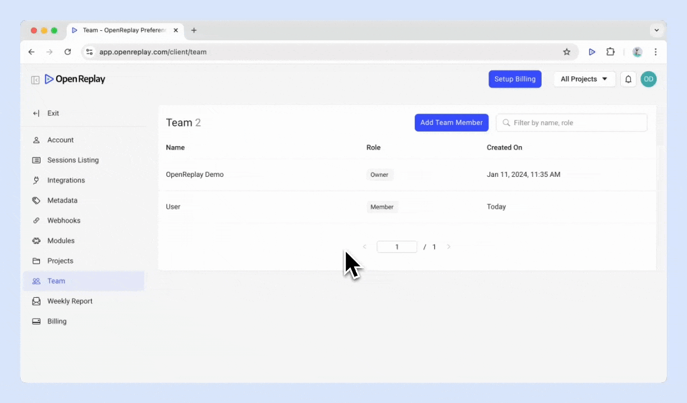

OpenReplay provides a flexible and secure system for managing users and their access. This guide outlines how to invite and manage users across different OpenReplay deployments, including FOSS, Cloud, and Enterprise setups. It also covers roles and permissions control, which is exclusive to Enterprise users.

## Invite Users

### Self-Hosted (FOSS and Enterprise)

For self-hosted setups, only one user can sign up during the initial configuration. After the first user is created, the signup page at `openreplay.<yourcustom-domain>/signup` will redirect to the login page.

To add additional users:

1. Navigate to **Preferences > Team** in the OpenReplay dashboard.
2. Click the **Add Team Member** button.
3. Fill in the user’s details:
   - **Full Name**
   - **Email Address**
4. (Optional) Select **Admin Privileges** to grant team and project management permissions.
5. Click **Invite**.

> **Note:** Ensure your SMTP server is configured to send email invitations. If not, you must manually copy and share the invitation link. Refer to the [SMTP Configuration Guide](https://docs.openreplay.com/configuration/configure-smtp) for setup details.

### Cloud Users

Cloud users (Serverless or Dedicated) can manage invitations through the dashboard. Invited users automatically receive email invitations when added.

1. Navigate to **Preferences > Team** in the OpenReplay dashboard.
2. Click the **Add Team Member** button.
3. Provide the user’s details as above.
4. Assign roles and privileges if applicable.

  

> **Cloud Users Access:** The user who first created the account has **Admin Privileges** and is assigned the role of **Owner**. All invitees are given the role **Member** by default if they are not granted with Admin Privileges, else they are given the  **Admin** .

## Remove Users

To remove a user:

1. Navigate to **Preferences > Team** in the OpenReplay dashboard.
2. Locate the user in the team list.
3. Click the **Edit** icon next to their name.
4. Click the **Delete** icon.

  

> **Note:** Admin Privileges are required to remove users.

## Roles and permissions

Roles and permissions allows administrators to define specific permissions for projects and features. This functionality is only available  for **[Enterprise users](https://openreplay.com/enterprise.html)**.

### Add a Role

1. Navigate to **Preferences > Roles and Access** in the OpenReplay dashboard.
2. Click the **Add** button.
3. Define the role:
   - **Title:** e.g., Developer.
   - **Project Access:** Select the projects the role can access.
   - **Feature Access:** Specify the features this role can access.
4. Save the role.

## Have Questions?

If you encounter any issues, reach out to us through our [Slack Community](#) and get direct assistance from our developers.
