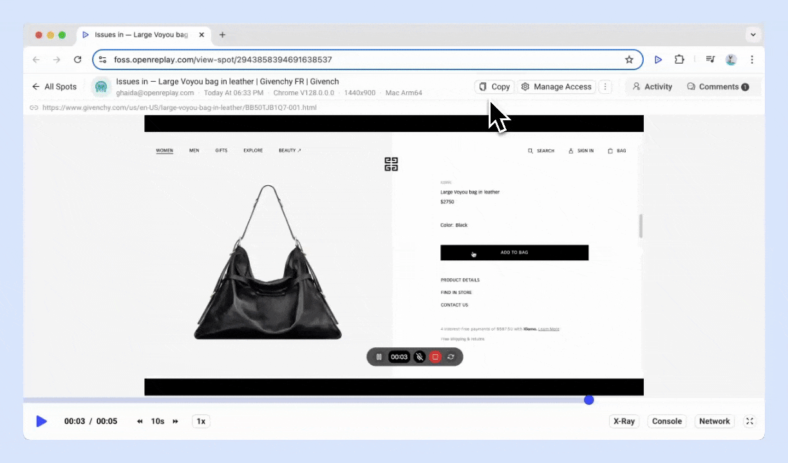

import YoutubeVideo from '~/components/YoutubeVideo.astro'

## What is Spot

[**Spot is a Chrome extension**](https://chromewebstore.google.com/detail/openreplay-spot-record-re/ckigbicapkkgfomcfmcbaaplllopgbid) that makes bug reporting blazingly fast and simple. 

With Spot, you can easily record bugs right from your browser and share them instantly with your team. 

The end-result is a complete, ready-to-share bug report in video format, including user actions, console logs and errors, network payloads, and user agent data.

In short, you get everything you need to report a bug faster than ever, and everything your team needs to fix it just as quickly.

## What you need to know

- Spot is available on every [OpenReplay plan.](https://www.openreplay.com/pricing.html)
- Spot is only available for the Google Chrome browser.

## How to install and set up the Spot Chrome extension

### 1. Install the extension

Installing the Spot Chrome extension is quick and easy:

1. Go to the [**Spot extension page on the Chrome Web Store**](https://chromewebstore.google.com/detail/openreplay-spot-record-re/ckigbicapkkgfomcfmcbaaplllopgbid) and click Add to Chrome.
2. Pin Spot to your Chrome toolbar for easy future access.

### 2. Set up your OpenReplay Spot account

Before you start using Spot, you need to either log in to your existing OpenReplay account or create a new one:

- **OpenReplay cloud**
    - **New users:**
        1. After pinning Spot, click on the Spot icon in your toolbar.
        2. Select **Create Account**.
        3. Choose your **primary use-case** for OpenReplay.
        - If you select "report bugs via Spot" as your primary use-case, you can later access the full OpenReplay features by clicking on **Setup Tracker**.
    - **Existing users:**
        1. Click on the pinned Spot extension in your toolbar.
        2. Select **Log in** and enter your OpenReplay credentials.
        - You can find your Spots in the Spot menu in the left sidebar.
- **OpenReplay self-host**
    - **New and existing users:**
        - Update your OpenReplay instance to the latest version (v1.20.0) that supports Spot.
        - Once updated, the Spot menu will appear in the left sidebar. Your Spots will be securely saved on your instance.

### 3. You’re ready to go!

Now that you’re logged in, you’re all set to start spotting and reporting bugs with Spot.

## How to use the Spot Chrome extension

Here’s how to use the Spot Chrome extension’s key features:

### Record tab

- **Start recording:** Click the Spot icon in your toolbar and select **Record Tab** to capture everything in the active tab.
- **Enable microphone:** If needed, toggle on the microphone option to include audio in your recording.
- **Pause recording:** Click on the pause icon from the recording panel at any time.
- **Restart recording:** Click on the restart icon from the recording panel to restart the recording.
- **Stop recording:** Click on the stop icon from the recording panel to stop the recording.
- **Add comments:** You can add comments to provide additional context before saving.
- **Save Spot:**  After stopping the recording, it will automatically save with all the relevant technical details, like console logs and network data.

### Record desktop

- **Start recording:** Click the Spot icon and select **Record Desktop**. Choose to record your entire screen or a specific window.

### Spot settings

- **Access settings:** Click the Spot icon in your toolbar and select the **Settings** icon.
- **Go to Spot tab after save:** Toggle this on to be directed to the Spot recording immediately after saving.
- **Include DevTools:** Toggle this on to include console logs, network calls, and other debugging information in your recording.

  

### Invite teammates

- **Send invites:** Click **Preferences**, go to **Team**, and click **Add Team Member**. Enter their full name and email address, then send the invitation.
- **Team access:** All team members can view Spot recordings in the **Spots** view in OpenReplay

*Spots are not tied to any specific project.*

### Share Spot

- **Private sharing:** Spot recordings can be shared via private links for internal viewing within your team on OpenReplay.
- **Public sharing:** You can create public links for external viewing, accessible even without an OpenReplay account.
- **Integration with tools:** Include these links in bug tracking or collaboration tools like Slack, Teams, Jira, or Linear for easy access and teamwork.

  

