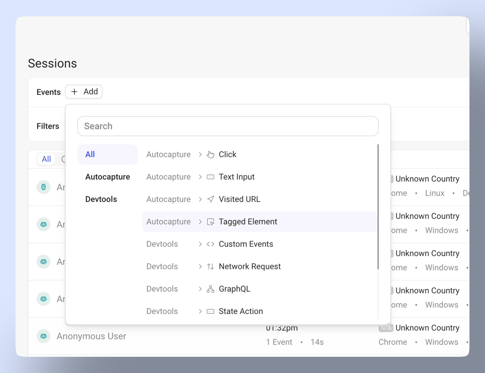
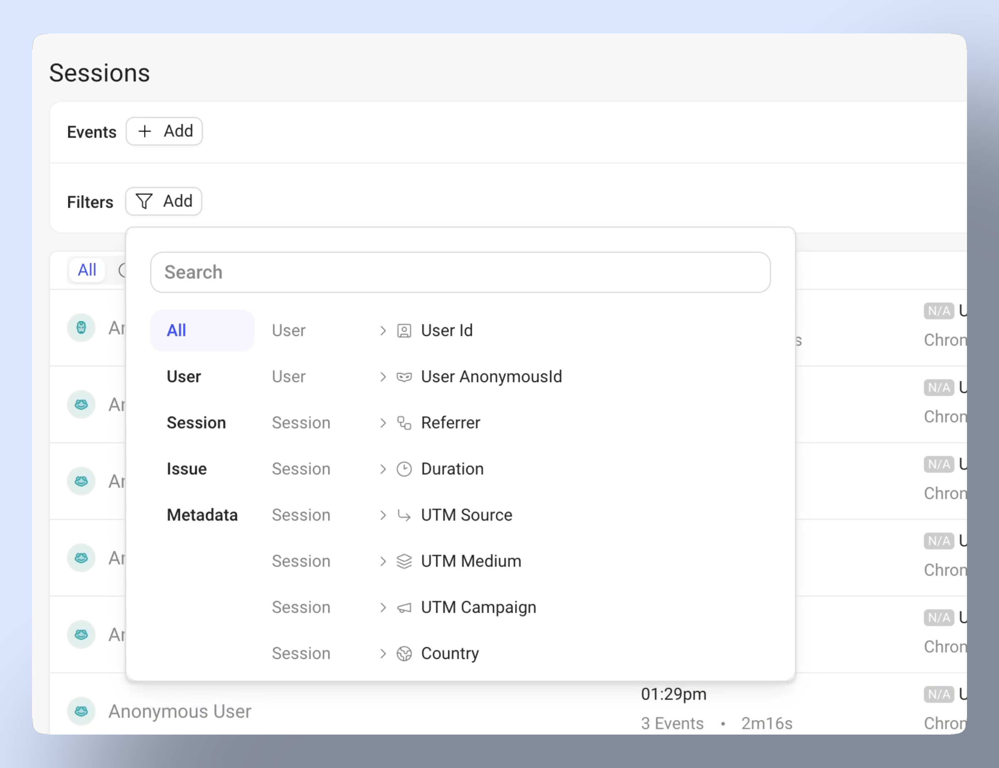
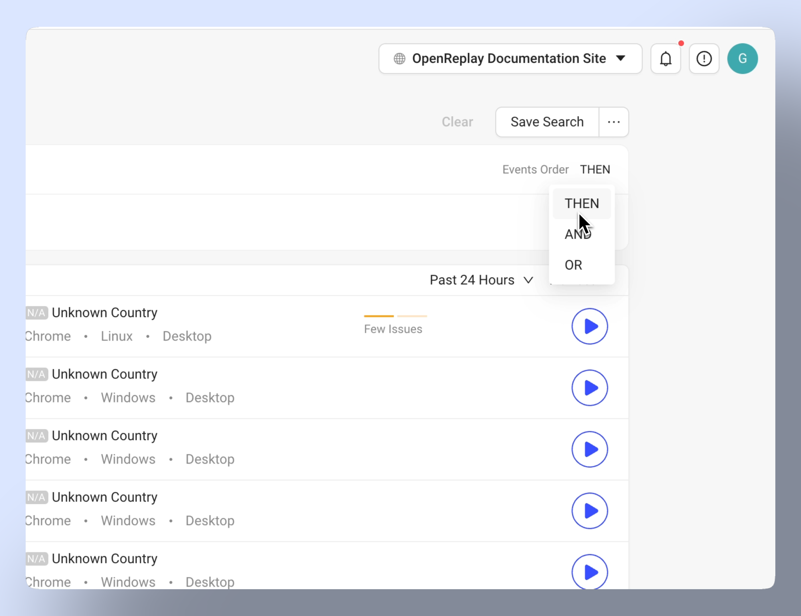
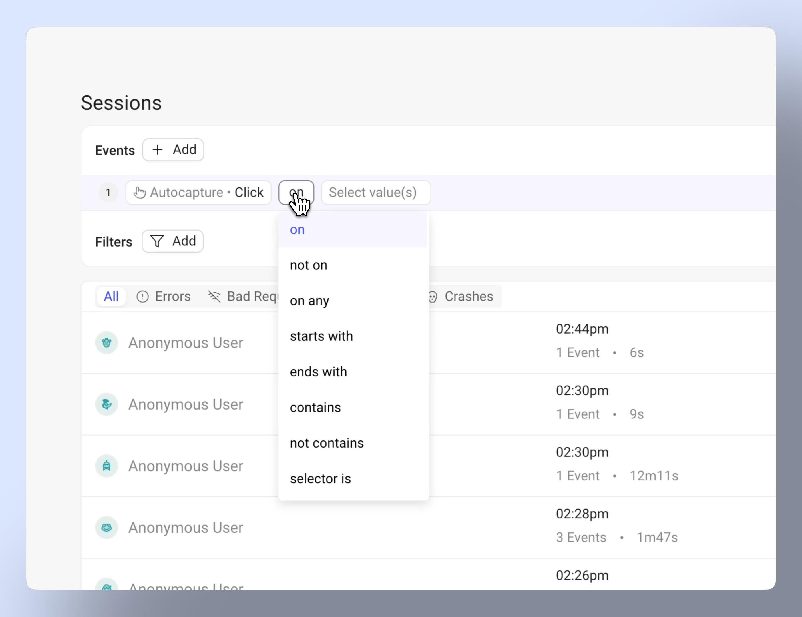
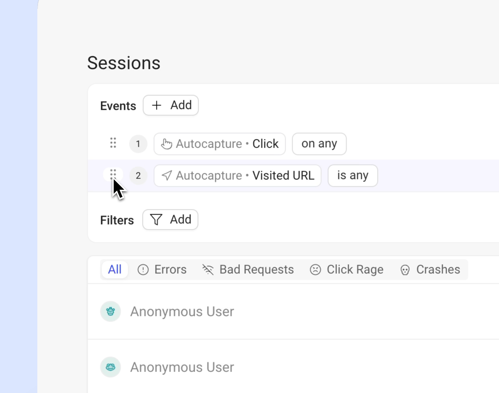
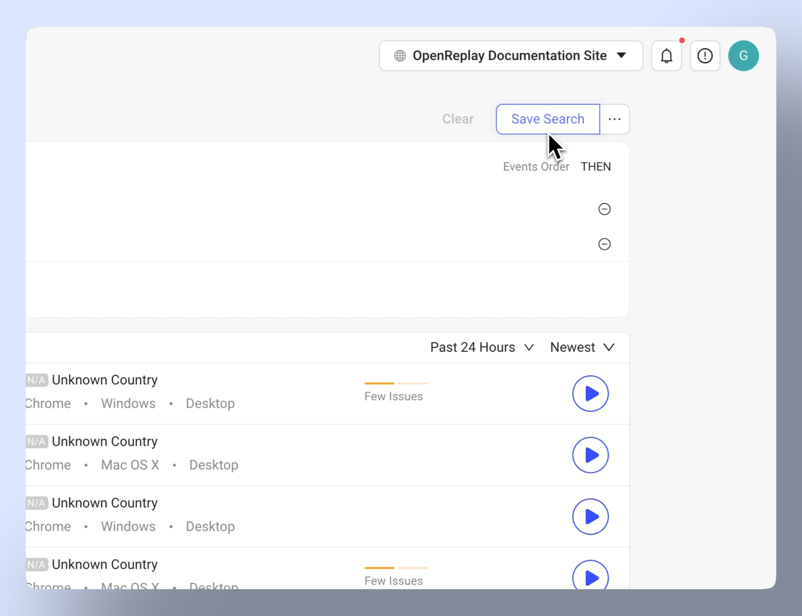

With the OpenReplay tracker set up and capturing user sessions, you're ready to uncover what's really happening in your product. OmniSearch helps you debug issues, identify what’s going wrong, and understand user behavior in detail. It bridges the gap between quantitative data and the qualitative insights hidden within your session replays.

## Getting started with OmniSearch

The OmniSearch component is available across various views in OpenReplay. Here, we focus on how the OmniSearch features in the Session Replays view, the primary interface for exploring all session replays.

1. **Events dropdown:** Choose from auto-captured user interactions and devTools events

  

   
2. **Filters dropdown:** Apply filters to narrow down results by user data, session properties, issues, and metadata

  

   
3. **Logic controls:** Switch between sequential ("Then") and parallel ("And"/"OR") events occurrence.

  

4. **Search operators:** Refine searches with "is," "contains," "starts with," and more

  

5. **Drag-and-drop events**: Rearrange events order to refine your search.

  

6. **Save frequently used searches for quick access:** Use the Save Search button to store event and filters groups and access them easily for similar future queries.

  

## Understanding events

**Events** in OmniSearch represent user interactions and system behaviors that occur during a session. 

They are divided into two main categories: **Autocaptured events** (automatic user interaction tracking) and **DevTools events** (technical monitoring and debugging). 

### Autocaptured events
| **Event name**  | **Description** |
| --- | --- |
| Click | Records user clicks. |
| Text Input | Tracks text entered in fields. |
| Visited URL | Logs visited pages |
| Tagged Element | Tracks custom-tagged elements. |

### DevTools events

|  **Event name**  | **Description** |
| --- | --- |
| Network Request | Monitors network activity. |
| GraphQL | Logs GraphQL queries and responses. |
| State Action | Tracks state changes in your application. |
| Error Message | Captures error messages in the console. |
| Average CPU Load | Measures average CPU usage. |
| Average Memory Usage | Tracks average memory consumption. |

## Understanding filters

**Filters** in OmniSearch help you narrow down session replays by specific criteria, allowing you to focus on the most relevant user sessions. They work in conjunction with events to create precise searches across your session data. 

Filters are organized into four main categories:

### User filters

|  **Filter name**  | **Description** |
| --- | --- |
| User ID | Filter on specific users using their unique identifiers. |
| Anonymous User ID | Filter sessions of users without a logged-in identity. |

### Session filters

|  **Filter name**  | **Description** |
| --- | --- |
| Country | Filter sessions by country. |
| City | Filter sessions by city. |
| State/Province | Filter sessions by state or province. |
| Operating System (OS) | Filter sessions by the operating system used. |
| Browser | Filter sessions by the browser type. |
| Device | Filter sessions by the user's device. |
| Platform | Filter sessions by the platform type. |
| Version ID | Filter sessions by the version of the application. |
| Referrer | Filter sessions based on the referring URL. |
| Duration | Filter sessions replays by their duration. |
| UTM Source | Filter sessions by UTM source parameter. |
| UTM Medium | Filter sessions by UTM medium parameter. |
| UTM Campaign | Filter sessions by UTM campaign parameter. |

### Issue filters

|  **Filter name**  | **Description** |
| --- | --- |
| Rage Click, Dead Click, Excessive Scrolling, Mouse Thrashing | Identify sessions with user frustration caused by repeated clicks, broken buttons or links, excessive scrolling, erratic mouse movement…. |
| Bad Request | Identify sessions with HTTP 400 errors. |
| Missing Resource | Find sessions with missing resources |
| CPU Issues | Identify sessions with high CPU usage. |
| Slow Resource | Identify sessions with slow-loading resources. |
| Slow Page Load | Identify sessions with slow page load times. |
| Crash | Identify sessions where the app or page crashed. |
| Errors | Identify sessions with application errors. |

### Metadata filters

|  **Filter name**  | **Description** |
| --- | --- |
| Metadata key | Use custom-defined metadata to filter sessions. If undefined, see how you can add metadata [here](/tutorials/metadata) |

## Have questions?

If you still have questions, make sure to reach out to our devs on our  [Slack community](https://slack.openreplay.com/).