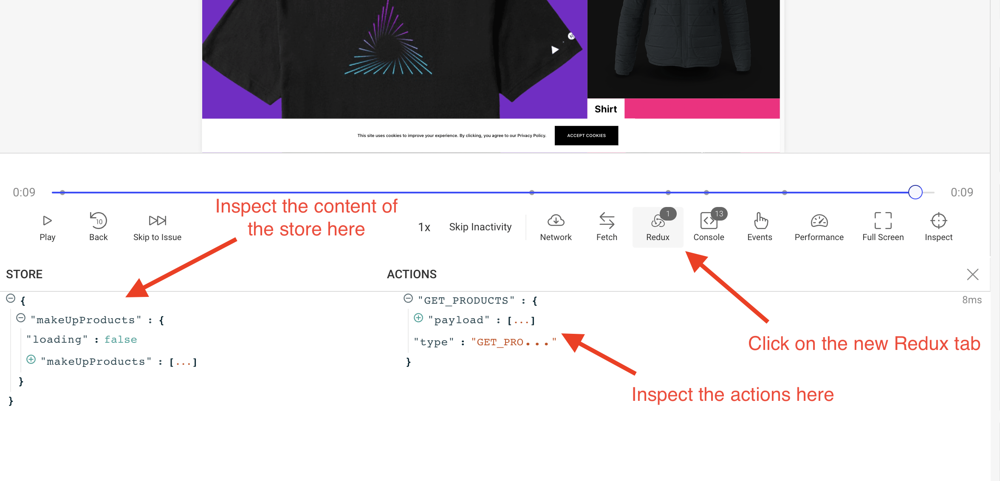

import Aside from '~/components/Aside.astro'
import YoutubeVideo from '~/components/YoutubeVideo.astro'

<YoutubeVideo title="Mira cómo rastrear el estado con Redux"
  description="Si no te gusta leer, puedes seguir este tutorial en vídeo que te muestra cómo rastrear el estado de tus aplicaciones React cuando usas Redux"
  videoURL="https://www.youtube.com/watch?v=vSg4_i-jCj0"
  />

Si necesitas mayor visibilidad al reproducir las sesiones de tus usuarios, echar un vistazo al estado de la aplicación puede ser de gran ayuda.

En el caso de Redux, OpenReplay [ofrece un plugin](https://docs.openreplay.com/plugins/redux) que te permite integrarte en el funcionamiento interno del store. Este plugin te dejará ver el estado del store de Redux y las acciones despachadas a lo largo de la sesión grabada.

Una vez configurado, deberías poder observar los cambios en el store como se ve en la siguiente captura de pantalla:



## Configurando Redux en un proyecto de Next.js

Para este tutorial, usaremos [este repositorio](https://github.com/deleteman/nextjs-commerce-example/tree/redux-store) (rama **redux-store**) de un sitio de comercio electrónico genérico construido con Next.js.

En este proyecto, reemplazaremos un conjunto de productos destacados por un conjunto de nuevos productos obtenidos de una API externa.

Para ello, añadiremos una función para solicitar los productos usando Axios, y lo haremos desde dentro de una acción de Redux.

**Nota:** Esta es una aplicación Next.js compleja, por lo que puede que no siga la estructura estándar que se encuentra en las clásicas apps de tareas (To-Do), pero siguiendo este tutorial deberías poder mantenerte al día con los cambios.

**Recuerda:** siempre puedes clonar el repositorio y revisar el código por ti mismo.

Empezaremos instalando todas las dependencias principales con:

```bash
npm i next-redux-wrapper redux react-redux redux-thunk redux-devtools-extension
```

Hecho esto, crea una carpeta llamada `store` en el directorio raíz de tu proyecto y reproduce la siguiente estructura:


El archivo `types.js` contendrá la definición de tipo de las dos acciones que vamos a definir:

```bash
export const GET_PRODUCTS = 'GET_PRODUCTS'
export const PRODUCTS_ERROR = 'PRODUCTS_ERROR'
```

El archivo `store.js` exportará una función que, CUANDO se llame, creará un nuevo store de Redux. Esto se debe a que necesitaremos añadir un nuevo middleware de Redux devuelto por el plugin de Redux (más sobre esto en un momento).

```jsx
import { createStore, applyMiddleware } from 'redux'
import thunk from 'redux-thunk'
import { composeWithDevTools } from 'redux-devtools-extension'

import rootReducer from './reducers'

const initalState = {}

export default function createReduxStore(extraMiddleware = []) {
  const middleware = [thunk, ...extraMiddleware]

  const store = createStore(
    rootReducer,
    initalState,
    composeWithDevTools(applyMiddleware(...middleware))
  )
  return store
}
```

Nuestro archivo reducer (`makeUpReducer.js`) actualizará el estado con la lista de productos o con el mensaje de error devuelto cuando hay un problema.

```jsx
import { GET_PRODUCTS, PRODUCTS_ERROR } from '../types'

const initialState = {
  makeUpProducts: [],
  loading: true,
}

export default function (state = initialState, action) {
  switch (action.type) {
    case GET_PRODUCTS:
      return {
        ...state,
        makeUpProducts: action.payload,
        loading: false,
      }
    case PRODUCTS_ERROR:
      return {
        loading: false,
        error: action.payload,
      }
    default:
      return state
  }
}
```

Y finalmente, el archivo de acciones definirá una única función, encargada de obtener la lista de productos desde una API externa y de despachar la acción y el payload correctos:

```jsx
import { GET_PRODUCTS, PRODUCTS_ERROR } from '../types'
import axios from 'axios'
import slugify from 'slugify'

export const getMakeUpProducts = () => async (dispatch: any) => {
  console.log('Getting the makeup products')

  try {
    let { data } = await axios.get(
      'https://makeup-api.herokuapp.com/api/v1/products.json?brand=maybelline&apiKey=123fff132'
    )
    const products = data

    let newProds = products.map((p: any) => {
      return {
        id: '' + p.id,
        slug: slugify(p.name),
        name: p.name,
        description: '',
        images: [{ url: p.image_link }],
        variants: [],
        price: {
          value: +p.price,
        },
        options: [],
      }
    })

    dispatch({
      type: GET_PRODUCTS,
      payload: newProds,
    })
  } catch (e) {
    dispatch({
      type: PRODUCTS_ERROR,
      payload: e,
    })
  }
}
```

## Configurando el proveedor del tracker

Para inyectar el tracker en la aplicación, usaremos un contexto proporcionado tal como se muestra en el [tutorial de Next.js](https://docs.openreplay.com/tutorials/next).

Este proveedor te permitirá configurar un conjunto de plugins; en nuestro caso, usaremos el plugin de Redux, de esta manera (desde dentro del archivo `_app.tsx`)

```jsx
//...more imports here....
import TrackerProvider from '../context/trackerProvider'
import trackerRedux from '@openreplay/tracker-redux'

// ... more code here....

export default function MyApp({ Component, pageProps }: AppProps) {
  const Layout = (Component as any).Layout || Noop

  useEffect(() => {
    document.body.classList?.remove('loading')
  }, [])

  let plugins = [
    {
      fn: trackerRedux,
      name: 'redux',
      config: {},
    },
  ]

  return (
    <TrackerProvider config={{ plugins }}>
      <Head />
      <ManagedUIContext>
        <Layout pageProps={pageProps}>
          <Component {...pageProps} />
        </Layout>
      </ManagedUIContext>
    </TrackerProvider>
  )
}
```

Ahora bien, este código te permite configurar el tracker con el plugin correcto, pero para que el plugin funcione, necesitaremos acceder al middleware devuelto cuando se llama al plugin. Eso significa que tendremos que llevar un registro de los valores devueltos por nuestros plugins para poder usarlos en otro lugar. En este caso, necesitaremos usarlo al llamar a la función `createReduxStore` de arriba.

Para hacer eso, tenemos que extender el `TrackerProvider` para asegurarnos de mantener el valor devuelto dentro del estado, de esta manera (puedes revisar la versión completa de este archivo [aquí](https://github.com/deleteman/nextjs-commerce-example/blob/redux-store/site/context/trackerProvider.js)):

```jsx
import { createContext, useCallback } from 'react'
import Tracker from '@openreplay/tracker'
import { v4 as uuidV4 } from 'uuid'
import { useReducer } from 'react'

export const TrackerContext = createContext()
function defaultGetUserId() {
  return uuidV4()
}
function newTracker(config) {
  ///code here
}
function reducer(state, action) {
  switch (action.type) {
    case 'init': {
      if (!state.tracker) {
        console.log('Instantiaing the tracker for the first time...')
        let t = newTracker(state.config)
        let pluginsReturnedValue = {}
        if (state.config.plugins) {
          state.config.plugins.forEach((p) => {
            console.log('Using plugin...')
            pluginsReturnedValue[p.name] = t.use(p.fn(p.config)) //keep track
          })
        }
        return {
          ...state,
          pluginsReturnedValue: pluginsReturnedValue, //update the state
          tracker: t,
        }
      }
      return state
    }
    case 'start': {
      console.log('Starting tracker...')
      state.tracker.start()
      return state
    }
  }
}
export default function TrackerProvider({ children, config = {} }) {
  let [state, dispatch] = useReducer(reducer, {
    tracker: null,
    pluginsReturnedValue: {},
    config,
  })
  let value = {
    startTracking: () => dispatch({ type: 'start' }),
    initTracker: () => dispatch({ type: 'init' }),
    pluginsReturnedValues: { ...state.pluginsReturnedValue }, //inject the state
  }
  return (
    <TrackerContext.Provider value={value}>{children}</TrackerContext.Provider>
  )
}
```

Dentro de la acción `init`, también llevamos un registro de los valores devueltos por el método `use` cuando se llama con nuestros plugins. Y mantenemos ese diccionario dentro de la propiedad `state.pluginsReturnedValue`. La cual ponemos a disposición de todos los hijos a través de la variable `pluginsReturnedValues`.

Esa lógica te permite usar el plugin al inicializar el tracker y luego acceder y usar el middleware más tarde.

## Creando el store de Redux con el nuevo middleware

Ahora que tenemos el plugin funcionando, necesitamos inicializar el store de Redux, y debemos hacerlo después de que el Tracker se haya inicializado y antes de que se llame al método `start`.

Para ello, he elegido el componente `ManagedUI`, que se usa directamente en el archivo `_app.tsx`. Este componente está envuelto por nuestro Tracker Provider, lo que significa que tendrá acceso al contexto que estamos compartiendo.

El componente se ve así:

```jsx
export const ManagedUIContext: FC = ({ children }) => {
  const { initTracker, pluginsReturnedValues } = useContext(TrackerContext)
  const [store, setStore] = useState<Store>()

  useEffect(() => {
    initTracker()
  }, [])

  useEffect(() => {
    if (!pluginsReturnedValues['redux']) return
    let middleWares = pluginsReturnedValues['redux']
      ? [pluginsReturnedValues['redux']]
      : []
    setStore(createReduxStore(middleWares))
  }, [pluginsReturnedValues])

  return (
    <div>
      {store && (
        <Provider store={store}>
          <UIProvider>
            <ThemeProvider>{children}</ThemeProvider>
          </UIProvider>
        </Provider>
      )}
    </div>
  )
}
```

Los puntos clave de este archivo son:

1. Estamos obteniendo la función `initTracker` y el atributo `pluginsReturnedValues` del contexto.
2. Llamamos a la primera solo una vez, cuando el componente se monta (a través del primer `useEffect`).
3. Luego creamos el store de Redux únicamente cuando la variable `pluginsReturnedValues` tiene nuestro valor devuelto. El segundo `useEffect` se llamará dos veces, una cuando la página carga y otra cuando el método `initTracker` modifica nuestra variable de estado. La segunda vez, crearemos el store con el middleware almacenado en `pluginsReturnedValues`.

## Iniciando el tracker

Con el plugin configurado y el store de Redux correctamente creado, todo lo que tenemos que hacer ahora es llamar al método `start` del tracker.

La lógica para esto se añadirá en el archivo index.tsx, y puedes echar un vistazo al código fuente completo de [este archivo aquí](https://github.com/deleteman/nextjs-commerce-example/blob/redux-store/site/pages/index.tsx).

La parte relevante de este código que necesitaremos revisar es la siguiente:

```jsx
// imports and more logic goes here...

export default function Home({
  products,
}: InferGetStaticPropsType<typeof getStaticProps>) {

  const { startTracking } = useContext(TrackerContext)
  const dispatch = useDispatch()
  const makeUpProductsList = useSelector((state: any) => state.makeUpProducts)
  const { makeUpProducts } = makeUpProductsList

  useEffect(() => {
    async function getProds() {
      await startTracking()
      dispatch(getMakeUpProducts() as any)
    }
    getProds()
  }, [dispatch])

  return (
    <>
      <Grid variant="filled">
        {products.slice(0, 3).map((product: any, i: number) => (
          <ProductCard
            key={product.id}
            product={product}
            imgProps={{
              width: i === 0 ? 1080 : 540,
              height: i === 0 ? 1080 : 540,
              priority: true,
            }}
          />
        ))}
      </Grid>
      <Marquee variant="secondary">
        {makeUpProducts.slice(0, 3).map((product: any, i: number) => (
          <ProductCard key={product.id} product={product} variant="slim" />
        ))}
      </Marquee>
      <!-- more code here -->
    </>
  )
}
```

Solo vamos a usar la función `startTracking` del proveedor de contexto del Tracker y el hook `useSelector` de Redux para capturar la lista de productos devueltos.

El hook `useEffect` desencadenará la llamada a `startTracking` y la obtención de la nueva lista de productos de maquillaje despachando la llamada a la función `getMakeUpProducts`.

Y con eso, deberías poder desplegar tu aplicación (siempre que hayas configurado la clave de API como se menciona [en este tutorial](https://docs.openreplay.com/tutorials/next))

## ¿Tienes preguntas?

Puedes [consultar este repositorio](https://github.com/deleteman/nextjs-commerce-example/tree/redux-store) para ver el **código fuente completo** de una aplicación funcional basada en Next.js con un store de Redux.

Si tienes algún problema configurando el plugin de Redux, contáctanos en nuestra [comunidad de Slack](https://slack.openreplay.com/) y pregúntales directamente a nuestros desarrolladores!
