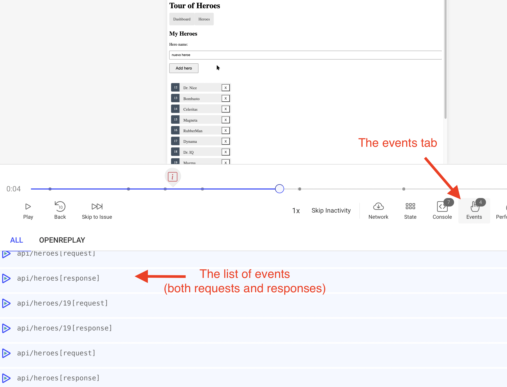

Es importante tener en cuenta que el rastreo **debe** ejecutarse fuera de los hooks de Zone.js de Angular para evitar solapamientos y comprobaciones innecesarias.

A continuación, un ejemplo sencillo de configuración del tracker:

```tsx
import { Injectable, NgZone } from '@angular/core';

import Tracker from '@openreplay/tracker';
import trackerAssist from '@openreplay/tracker-assist';

@Injectable({
  providedIn: 'root',
})
export class OpenReplayService {
  public tracker?: Tracker | null;

  constructor(private zone: NgZone) {
    this.zone.runOutsideAngular(() => {
      this.tracker = new Tracker({
        projectKey: 'abc123',
        ingestPoint: 'https://someurl/',
      });

      this.tracker.use(
        trackerAssist({
          confirmText: `You have an incoming call from <Company> Support. Do you want to answer?`,
        })
      );
    });
  }

  public async start() {
    this.zone.runOutsideAngular(() => {
      if (this.tracker) {
        return this.tracker.start();
      } else {
        return {
          sessionID: null,
          sessionToken: null,
          userUUID: null,
        };
      }
    });
  }

  public setUserData(user: { id: string }): void {
    this.zone.runOutsideAngular(() => {
      if (this.tracker && user.id) {
        this.tracker.setUserID(String(user.id));
      }
    });
  }
}

```

## Rastreo de las solicitudes HTTP

Si intentas rastrear las solicitudes enviadas con tu aplicación Angular, OpenReplay no ofrece un plugin como sí lo hace para Fetch o Axios.

Dicho esto, todavía puedes configurarlo para rastrear tus solicitudes con la información que desees mediante un [HTTPInterceptor](https://angular.io/api/common/http/HttpInterceptor).

En este tutorial te mostraré cómo crear un HTTPInterceptor capaz de registrar tanto las solicitudes como las respuestas enviadas por tu HTTPClient.

## Creación del interceptor

El interceptor es un tipo particular de objeto que puedes inyectar en el código de tu aplicación para capturar cada una de las solicitudes enviadas con el cliente HTTP predeterminado de Angular y capturar la respuesta.

Mediante esta lógica, aprovecharemos los eventos personalizados de OpenReplay, que te permiten enviar cualquier evento que quieras que se capture dentro de tu sesión, de modo que imitaremos lo que el plugin de Fetch o Axios haría en otras configuraciones.

El código del interceptor es el siguiente:

```tsx
import { Injectable } from '@angular/core';
import {
  HttpInterceptor,
  HttpRequest,
  HttpHandler,
  HttpEvent,
  HttpResponse,
} from '@angular/common/http';

import { Observable } from 'rxjs';
import { filter, map } from 'rxjs/operators';
import { ReplaySessionService } from '../replay-session.service';

@Injectable({providedIn: 'root'})
export class HttpConfigInterceptor implements HttpInterceptor {
  constructor(
    private replaySessionService: ReplaySessionService,
  ) { }
  intercept(request: HttpRequest<any>, next: HttpHandler): Observable<HttpEvent<any>> {
    
		//This function will be called with the response a few lines below
		const handleResponse = (request: HttpRequest<any>, response: HttpResponse<any>, event: string) => {
	     //we forward our data to the service, which will create the custom event and send it
			this.replaySessionService.sendEventToReplaySession(event, { request, response })
    }
    return next.handle(request).pipe(
      //filter out events that aren't http reponses
      filter( (event: any) => event instanceof HttpResponse),
      map( (resp: HttpResponse<any>) => { //for each response, call handleResponse
        handleResponse(request, resp, `${request.url}`)
        return resp
      }),
      map((event: HttpEvent<any>) => {
        return event;
      })
    );
  }
}
```

Veremos el servicio de replay en un momento, pero por ahora simplemente da por hecho que está ahí. Guarda este archivo dentro de tu carpeta `app`.

Luego edita el archivo `app.module` para añadir lo siguiente dentro de la directiva @ngModule:

```tsx
providers: [
    {provide: HTTP_INTERCEPTORS, useClass: HttpConfigInterceptor, multi: true}
  ]
```

Así, el archivo `app.module` debería verse más o menos así:

```tsx
import { NgModule } from '@angular/core';

/*
imports...
*/
import { HttpConfigInterceptor } from './interceptor/index';

@NgModule({
  imports: [
   /*...*/
  ],
  providers: [
    {provide: HTTP_INTERCEPTORS, useClass: HttpConfigInterceptor, multi: true}
  ],
  declarations: [
    /*...*/
  ],
  bootstrap: [ AppComponent ]
})
export class AppModule { }
```

Resuelto esto, tu aplicación ya sabe que debe inyectar tu interceptor en cada solicitud HTTP realizada.

Ahora echemos un vistazo al servicio de session replay propiamente dicho.

## Creación del SessionReplayService

Primero, añade tu nuevo servicio con el siguiente comando:

```tsx
$ ng generate service replay-session
```

Esto creará un nuevo servicio de Angular en la raíz de tu aplicación llamado `replay-session.service.ts`

El contenido de ese archivo debería verse así:

```tsx
import { Injectable } from '@angular/core';
import {
  HttpInterceptor,
  HttpRequest,
  HttpHandler,
  HttpResponse,
} from '@angular/common/http';
import OpenReplay from '@openreplay/tracker'

type ReqRespType = {
  request: HttpRequest<any>,
  response: HttpResponse<any>
}

@Injectable({
  providedIn: 'root'
})
export class ReplaySessionService {
  tracker: OpenReplay|null = null

  constructor() {

    this.tracker = new OpenReplay({
        projectKey: "<YOUR PROJECT KEY>",
    })
		//you can set up any other OR plugins here as well

    this.tracker.start()
   }

  sendEventToReplaySession(event: string, params: ReqRespType): void {
    const {request, response} = params

    this.tracker?.event(event + "[request]", {
      method: request.method,
      url: request.url,
      params: request.params
    })
    this.tracker?.event(event + "[response]", {
      body: response.body,
      status: response.status,
      headers: response.headers
    })
  }
}
```

El constructor de la clase, que dado que se trata de un servicio sabemos que solo se llamará una vez, se encarga de instanciar el tracker y ponerlo en marcha.

Luego, en nuestro método `sendEventToReplaySession`, usamos el método `event` para enviar dos eventos personalizados.

Si vuelves a la clase del interceptor, notarás que el "event" (el primer parámetro que recibimos en este método) es en realidad la URL, por lo que les añado las palabras "[response]" y "[request]" para identificar qué se registra dónde.

Después creo las cargas útiles (payloads) de cada evento, guardando únicamente la información que quiero guardar.

Con esto funcionando, esto es lo que verás dentro de la pestaña Events en tu replay:



Y si haces clic en los detalles de una de estas filas, obtienes la carga útil que guardamos:


De hecho, incluso puedes tomar ese código y sanear cualquier campo de la solicitud o de la respuesta que no quieras que sea visible dentro del replay antes de llamar al método `event`.

Puedes [consultar este repositorio](https://github.com/deleteman/openreplay-angular-example) para ver el **código fuente completo** de una aplicación basada en Angular en funcionamiento con el Tracker.

## ¿Tienes preguntas?

Si tienes algún problema al configurar el Tracker en tu proyecto de Angular, contáctanos en nuestra [comunidad de Slack](https://slack.openreplay.com/) y pregúntale directamente a nuestros desarrolladores.
