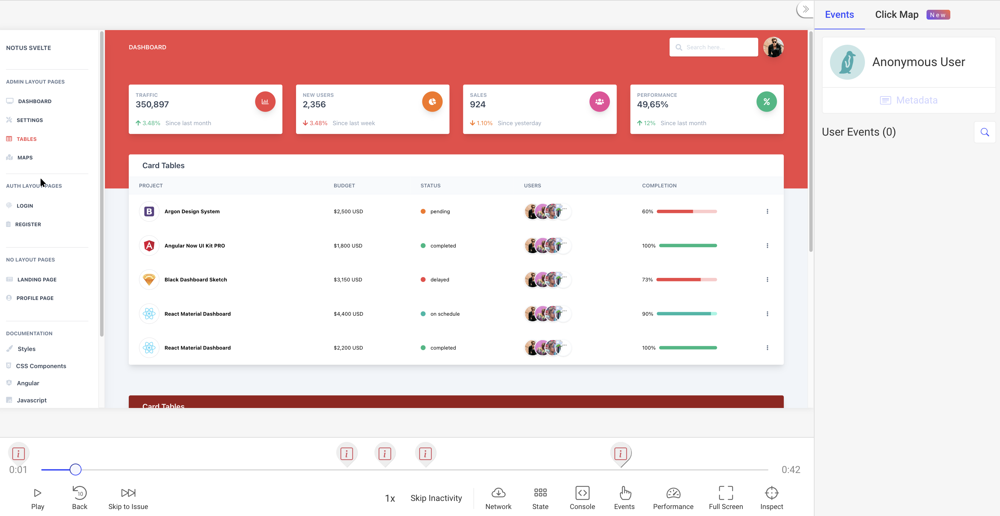

Instalar el tracker de OpenReplay en un proyecto basado en Svelte es relativamente sencillo.

La clave para que funcione será el uso del contexto, que, aunque suena similar a cómo lo hacemos con Next.js, la implementación será diferente.

## SvelteKit y el comportamiento de SSR

Como nuestro tracker necesita el contexto del navegador para ejecutarse, es posible que tengas que ajustar el ejemplo de "Creación del contexto del tracker" como se muestra a continuación para asegurarte de que se importe y se cree del lado del cliente:

```jsx
<script>
  import { onMount } from 'svelte';

  onMount(async () => {
    if (process.browser) {
      const Tracker = await import('@openreplay/tracker');
      const tracker = new Tracker({
	      projectKey: "", // pKey
	      ingestPoint: "ingestPoint",
      })
      
      tracker.start()
    }
  })
</script>
```

## Repositorio de ejemplo

Si quieres revisar el código completo de este proyecto, echa un vistazo a [el repositorio que usaremos a lo largo de este tutorial](https://github.com/deleteman/openreplay-svelte-example).

Es una aplicación SvelteKit de ejemplo que puedes clonar y probar tú mismo siguiendo las instrucciones del archivo Readme.

Una vez desplegada y configurada, deberías poder capturar repeticiones de sesión como se ve en la captura de pantalla a continuación:



## Uso del contexto para compartir datos

Esta solución usará el Contexto de Svelte, que te permite compartir datos entre un componente padre y todos sus hijos (muy parecido a los proveedores de Contexto de React).

En este ejemplo en particular, agregaremos el tracker para la sección de Administración de nuestra aplicación, así que configuraremos el contexto dentro del archivo de diseño de Administración (`src/layout/Admin.svelte`). Luego lo iniciaremos en la primera página renderizada dentro de esta sección.

## Creación del contexto del tracker

Dentro del archivo `src/layout/Admin.svelte`, en la etiqueta `script`, agreguemos el siguiente código:

```jsx
import {Tracker, key} from "../context/tracker"

let tracker = new Tracker({
    projectKey: __myapp.env.OPENREPLAY_PROJECT_KEY
});
  
setContext(key, {
 getTracker: () => tracker
} )
```

Por supuesto, tendrás más código dentro de este archivo, pero lo que ves arriba es lo relevante para nosotros en este momento.

1. Primero importamos el Tracker de OpenReplay y una variable key (más sobre esto en un momento).
2. Luego instanciamos el Tracker. Como puedes ver, la única opción de configuración que usamos es la key del proyecto, que obtendrías desde la interfaz de usuario después de configurar el proyecto en OpenReplay.
3. Guardamos la instancia del tracker en el contexto creado al llamar a `setContext`. La variable `key` se usará más adelante para recuperar este valor en particular del contexto.

💡**Una nota para los usuarios self-hosted:** si estás usando la versión self-hosted de OpenReplay, también tendrás que especificar la propiedad de configuración `ingestPoint` en el paso 2. Esta propiedad especifica el endpoint de ingesta para los datos del tracker. Los usuarios de la nube no necesitan esto, porque, de forma predeterminada, el tracker sabrá dónde está la versión SaaS de este endpoint, pero si 
lo estás alojando tú mismo, tendrás que especificarlo (debería ser algo como `https://openreplay.mydomain.com/ingest`).

## Uso del contexto del tracker

Usar el contexto (y llamar al método `start`) es tan simple como obtener el contexto a través de la función `getContext` de Svelte.

El contexto tenía un objeto con una función llamada getTracker, así que lo desestructuraremos y llamaremos a esa función.

```jsx
import {key} from "../../context/tracker"
  
let {getTracker} = getContext(key)
onMount( () => {
	let tracker = getTracker()
	tracker.start()
})
```

Después, solo es cuestión de llamar al método `start` desde dentro del callback de `onMount`. Hacemos esto para asegurarnos de que estamos llamando a este método desde el navegador, de lo contrario el tracker no funcionará.

## El archivo context/tracker

Hemos estado usando este archivo en ambos lugares, así que es hora de echarle un vistazo rápido.

Este archivo exporta dos elementos principales:

1. La clase `Tracker`, que hemos instanciado en el archivo de diseño.
2. Usamos la variable `key` para guardar y recuperar el contexto.

Aquí está el contenido del archivo:

```jsx
import Tracker from '@openreplay/tracker'

const key = Symbol("openreplay tracker")

export {Tracker, key}
```

Lo único interesante aquí es que la variable `key` no es una simple cadena, en realidad es un `Symbol`. La razón de esto es evitar posibles colisiones de nombres con otras bibliotecas de terceros que también usen el contexto.

## Gestión de las variables de entorno (ENV)

Lo último que repasaremos aquí es cómo gestionamos la key del proyecto, ya que no debería estar codificada de forma fija en tu código.

Normalmente, usarías una variable de entorno para esto; sin embargo, dado que necesitamos esos datos en el navegador y Svelte no proporciona una forma sencilla de lograrlo, resolveremos este problema con dos paquetes: [dotevn](https://www.npmjs.com/package/dotenv) y [@rollup/plugin-replace](https://www.npmjs.com/package/@rollup/plugin-replace).

Por un lado, usaremos el paquete dotenv para obtener la capacidad de definir nuestras variables de entorno dentro de un archivo `.env`. Definiremos la que necesitamos: 

```jsx
OPENREPLAY_PROJECT_KEY="<YOUR PROJECT KEY>"
```

Por otro lado, dado que no podemos usar `dotenv` en nuestro código de front-end (porque depende del módulo `fs`, que claramente no está disponible en el navegador), usaremos el plugin replace de rollup. Este plugin reemplazará código en nuestros archivos por lo que le indiquemos. Así que configuraremos el plugin para reemplazar la cadena `“__myapp.env.OPENREPLAY_PROJECT_KEY”` con la key real del proyecto cargada desde el archivo `.env` (gracias al paquete dotenv).

Para lograr esto, abre el archivo `rollup.config.js` en la raíz del proyecto y agrega el siguiente código dentro de la clave `plugins`.

```jsx
replace({
  "__myapp.env.OPENREPLAY_PROJECT_KEY": `"${process.env.OPENREPLAY_PROJECT_KEY}"`
})
```

Este plugin se ejecutará en el backend durante el proceso de empaquetado (bundling), haciendo posible que esto funcione. Si quieres inspeccionar el contenido completo de este archivo de configuración, puedes [consultarlo aquí](https://github.com/deleteman/openreplay-svelte-example/blob/main/rollup.config.js).

## ¿Tienes preguntas?

Puedes [consultar este repositorio](https://github.com/deleteman/openreplay-svelte-example) para ver el **código fuente completo** de una aplicación basada en Svelte que funciona con el Tracker.

Si tienes algún problema configurando el Tracker en tu proyecto Svelte, contáctanos en nuestra [comunidad de Slack](https://slack.openreplay.com/) y pregunta directamente a nuestros desarrolladores.
