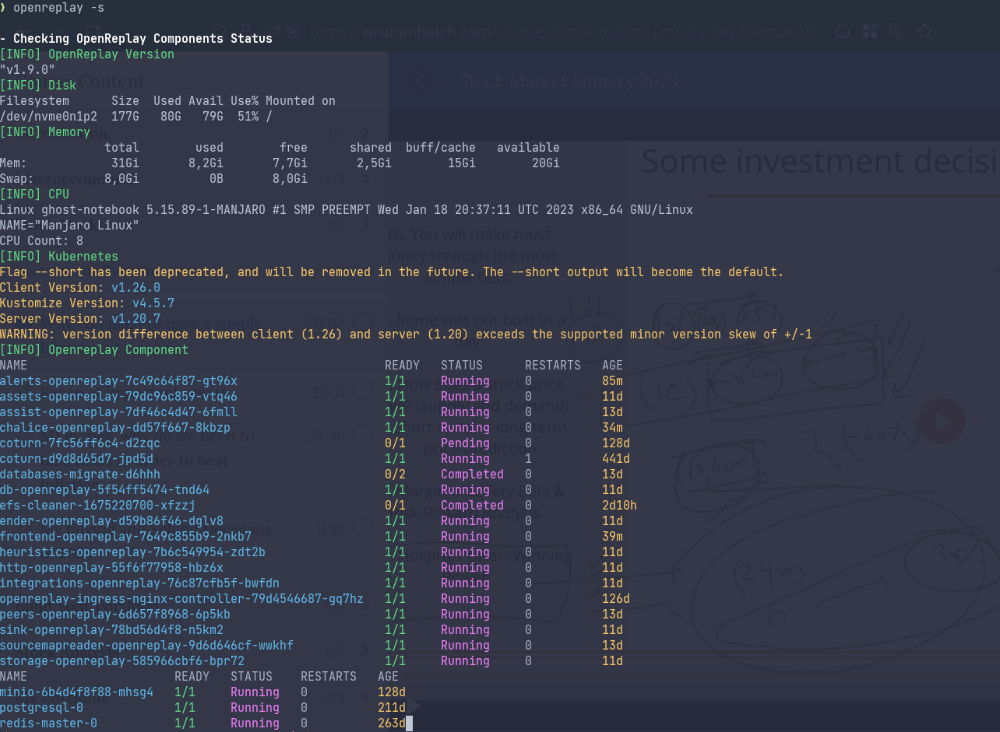

Начиная с версии v1.10.0 мы выпустили нашу утилиту CLI. С её помощью наиболее распространённые задачи, которые вам приходилось бы выполнять для управления вашей самостоятельно размещённой версией OpenReplay, теперь можно выполнять простой командой.


## Установка CLI

CLI поставляется с каждой самостоятельно размещённой версией OpenReplay.

## Использование CLI

CLI имеет следующий синтаксис:

```bash 
openreplay [command] <service>
```

Список доступных команд:

- `-h or --help`: Эта команда отобразит список доступных команд и служб.
- `-s or --status`: Если вы хотите узнать статус развёрнутых служб, эта команда сообщит вам всё, что нужно знать.
- `-u or --upgrade`: Используется для обновления вашей установки до последней доступной версии.
- `-U or --deprecated-upgrade /path/to/old_vars.yaml`
- `-r or --restart`: Позволяет перезапустить все службы. Таким образом вы можете исправить не отвечающие службы.
- `-R or --Reload`: Перезагружает конфигурацию службы, поэтому используйте её только при внесении изменений.
- `-p or --install-packages`: Обновляет все сторонние зависимости (такие как `kubectl`, `helm` и т. д.).
- `-i or --install domain.name.com`: Устанавливает OpenReplay на машину.
- `-e or --edit`: Редактирует установленную конфигурацию OpenReplay и перезагружает её.
- `-l or --logs SERVICE`: Показывает логи одной конкретной службы.

Список всех служб, доступных для CLI:

- alerts
- assets
- assist
- chalice
- db
- ender
- frontend
- heuristics
- http
- integrations
- ngix-controller
- peers
- sink
- sourcemapreader
- storage
- image-storage
- video-storage

## Пример

Чтобы получить статус развёртывания, выполните приведённую ниже команду CLI:

```bash 
openreplay -s 
```

Результат будет примерно таким:



## Остались вопросы?

Если вы столкнётесь с какими-либо проблемами, подключайтесь к нашему [Slack](https://slack.openreplay.com) или загляните на наш [Форум](https://forum.openreplay.com) и получите помощь от нашего сообщества.
