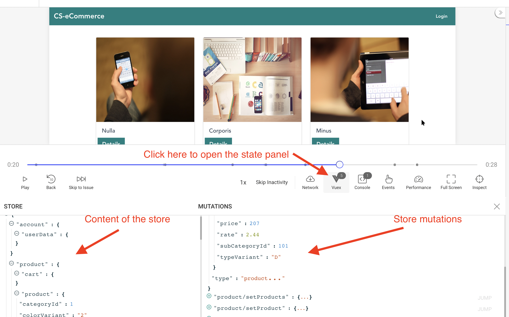

Если вы используете VueX для управления состоянием своих приложений на основе Vue, то интегрировать [плагин OpenReplay](https://docs.openreplay.com/plugins/vuex) для отслеживания обновлений состояния очень просто.

Если хотите повторять действия по ходу, используйте [код, опубликованный](https://github.com/deleteman/openreplay-vuex-example) здесь.

## Интеграция Tracker в ваш код

Первое, о чём нам нужно позаботиться, — это интеграция трекера OpenReplay в проект. Мы имеем дело с проектом на основе Vue, а это значит, что нашей точкой входа будет файл `main.js`. Сначала установите трекер с помощью:

```tsx
yarn add @openreplay/tracker
```

Или используйте npm, если предпочитаете:

```tsx
npm install @openreplay/tracker
```

После этого, когда вы настроите проект внутри платформы, получите KEY проекта и сохраните его в файле `.env`, расположенном в корне проекта.

```bash
VUE_APP_OPENREPLAY_PROJECT_KEY=<your project key here>
```

Обратите внимание на имя переменной окружения. Оно начинается с `VUE_APP_`, потому что, когда мы делаем так, WebPack заменит её значение везде, где мы используем код `process.env.VUE_APP_OPENREPLAY_PROJECT_KEY`, избавляя нас от необходимости отправлять сам файл конфигурации клиенту.

Теперь внутри папки `src` создайте папку `tracker` и файл `index.js` внутри неё. Этот файл будет экспортировать одну функцию: `startTracker`, которая всё настроит и запустит трекер.

```jsx
import Tracker from '@openreplay/tracker';

import {v4 as uuidV4} from 'uuid'

function defaultGetUserId() {
   return uuidV4() 
}

export function startTracker(config) {

    console.log("Starting tracker...")

    const getUserId = (config?.userIdEnabled && config?.getUserId) ? config.getUserId : defaultGetUserId
    let userId = null;

    const trackerConfig = {
        projectKey: config.projectKey
    }

    const tracker = new Tracker(trackerConfig);

    const pluginReturns = {}
    Object.keys(config?.plugins).forEach( pk => {
        pluginReturns[pk] = tracker.use(config?.plugins[pk]())
    })
 
    if(config?.userIdEnabled) {
        userId = getUserId()
        tracker.setUserID(userId)
    }
    console.log("tracker: user id: ", userId)

    tracker.start();
    return {
        tracker,
        userId,
        ...pluginReturns
    }
}
```

Теперь единственное, о чём вам нужно беспокоиться, — это то, что эта функция делает всё, что вам нужно. Всё, что вам нужно сделать, — это передать ключ проекта при её вызове. Вот так (из файла `main.js`):

```jsx
import {startTracker} from './tracker/index'

let {vuexTracker} = startTracker({
    projectKey: process.env.VUE_APP_OPENREPLAY_PROJECT_KEY,
})
```

Как мы уже видели, строка `process.env.VUE_APP_OPENREPLAY_PROJECT_KEY` будет заменена вашим реальным ключом проекта при рендеринге страницы.

Теперь давайте добавим плагин VueX, чтобы мы также могли начать отслеживать изменения состояния.

## Добавление плагина VueX

Плагин легко устанавливается одной строкой:

```jsx
yarn add @openreplay/tracker-vuex
```

После этого мы можем импортировать его в наш код и передать как часть объекта конфигурации в функцию `startTracker`.

Вернитесь к определению этой функции и обратите внимание, что у нас уже есть код для обработки плагинов. На самом деле элемент `plugins` в конфигурации — это карта, которая принимает плагины (с ключом по нашему выбору) и возвращает то, что мы получаем при вызове метода `use`, также по тому же ключу, который мы использовали для плагина.

Позвольте показать вам; это снова в файле `main.js`:

```jsx
//your other imports go here...
import trackerVuex from '@openreplay/tracker-vuex';
import store from './store'

let {vuexTracker} = startTracker({
    userIdEnabled: true,
    projectKey: process.env.VUE_APP_OPENREPLAY_PROJECT_KEY,
    plugins:{
      'vuexTracker': trackerVuex
    } 
})

new Vue({
  router,
  store: store([vuexTracker]),
  render: h => h(App)
}).$mount('#app')
```

Обратите внимание, как мы:

1. Вызываем функцию `startTracker` с картой `plugins`. Строка «vuexTracker» — это то, что я придумал в тот момент, но здесь вы можете использовать любую строку.
2. Деструктурируем ответ и получаем ключ «vuexTracker» (тот же ключ, который мы использовали для карты). Пока эти два ключа совпадают, вы можете использовать любую строку.
3. Передаём функцию `vuexTracker` в качестве параметра в функцию `store`.

Переменная vuexTracker по сути содержит наш плагин VueX; этот плагин будет подключён к хранилищу VueX, и для этого мы используем следующий код:

```jsx
import Vue from 'vue'
import Vuex from 'vuex'

import account from './account'
import product from './product'

Vue.use(Vuex)

export default function (plugins = []) {
  return function() {
    const Store = new Vuex.Store({
      modules: {
        account,
        product
      },

      strict: process.env.DEV,
      plugins
    })

    return Store
  }
}
```

Приведённый выше фрагмент — это ваш стандартный код для настройки хранилища; мы просто добавили возможность настраивать плагины, чтобы убедиться, что мы можем отслеживать то, что происходит с состоянием в нашем приложении.

Как только это будет готово, вы должны увидеть новую опцию VueX внутри повторов сессий, вот так:



## Есть вопросы?

Вы можете [посмотреть этот репозиторий](https://github.com/deleteman/openreplay-vuex-example), чтобы получить **полный исходный код** рабочего приложения, использующего VueX с Tracker.

Если у вас возникнут какие-либо проблемы с настройкой Tracker или плагина VueX в вашем проекте, свяжитесь с нами в нашем [сообществе Slack](https://slack.openreplay.com/) и задайте вопросы нашим разработчикам напрямую!
