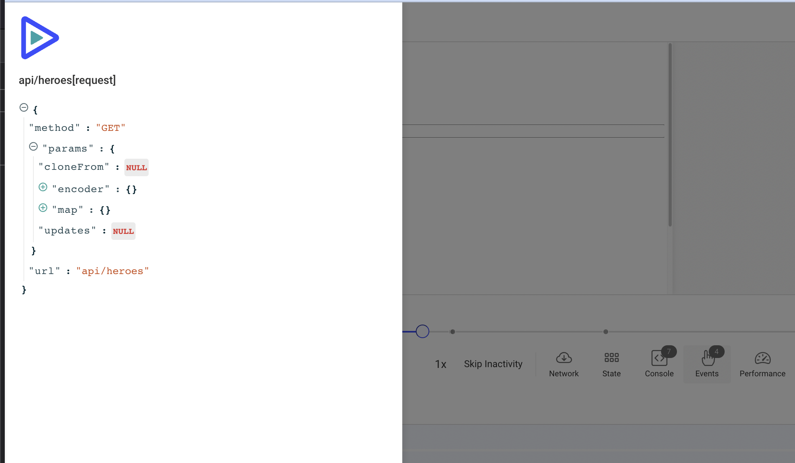

Важно помнить, что отслеживание **должно** выполняться вне хуков Zone.js в Angular, чтобы избежать наложений и ненужных проверок.

Вот простой пример настройки трекера:

```tsx
import { Injectable, NgZone } from '@angular/core';

import Tracker from '@openreplay/tracker';
import trackerAssist from '@openreplay/tracker-assist';

@Injectable({
  providedIn: 'root',
})
export class OpenReplayService {
  public tracker?: Tracker | null;

  constructor(private zone: NgZone) {
    this.zone.runOutsideAngular(() => {
      this.tracker = new Tracker({
        projectKey: 'abc123',
        ingestPoint: 'https://someurl/',
      });

      this.tracker.use(
        trackerAssist({
          confirmText: `You have an incoming call from <Company> Support. Do you want to answer?`,
        })
      );
    });
  }

  public async start() {
    this.zone.runOutsideAngular(() => {
      if (this.tracker) {
        return this.tracker.start();
      } else {
        return {
          sessionID: null,
          sessionToken: null,
          userUUID: null,
        };
      }
    });
  }

  public setUserData(user: { id: string }): void {
    this.zone.runOutsideAngular(() => {
      if (this.tracker && user.id) {
        this.tracker.setUserID(String(user.id));
      }
    });
  }
}

```

## Отслеживание HTTP-запросов

Если вы пытаетесь отслеживать запросы, отправляемые вашим приложением на Angular, OpenReplay не предоставляет плагин, как он это делает для Fetch или Axios.

Тем не менее вы всё равно можете настроить отслеживание запросов с нужной вам информацией с помощью [HTTPInterceptor](https://angular.io/api/common/http/HttpInterceptor).

В этом руководстве я покажу вам, как создать HTTPInterceptor, способный записывать как запросы, так и ответы, отправляемые вашим HTTPClient.

## Создание перехватчика

Перехватчик — это особый тип объекта, который вы можете внедрить в код вашего приложения, чтобы захватывать каждый запрос, отправляемый с помощью HTTP-клиента Angular по умолчанию, и захватывать ответ.

С помощью этой логики мы воспользуемся пользовательскими событиями OpenReplay, которые позволяют отправлять любое событие, которое вы хотите захватить внутри вашей сессии, так что мы воспроизведём то, что делал бы плагин Fetch или Axios в других конфигурациях.

Код перехватчика выглядит следующим образом:

```tsx
import { Injectable } from '@angular/core';
import {
  HttpInterceptor,
  HttpRequest,
  HttpHandler,
  HttpEvent,
  HttpResponse,
} from '@angular/common/http';

import { Observable } from 'rxjs';
import { filter, map } from 'rxjs/operators';
import { ReplaySessionService } from '../replay-session.service';

@Injectable({providedIn: 'root'})
export class HttpConfigInterceptor implements HttpInterceptor {
  constructor(
    private replaySessionService: ReplaySessionService,
  ) { }
  intercept(request: HttpRequest<any>, next: HttpHandler): Observable<HttpEvent<any>> {
    
		//This function will be called with the response a few lines below
		const handleResponse = (request: HttpRequest<any>, response: HttpResponse<any>, event: string) => {
	     //we forward our data to the service, which will create the custom event and send it
			this.replaySessionService.sendEventToReplaySession(event, { request, response })
    }
    return next.handle(request).pipe(
      //filter out events that aren't http reponses
      filter( (event: any) => event instanceof HttpResponse),
      map( (resp: HttpResponse<any>) => { //for each response, call handleResponse
        handleResponse(request, resp, `${request.url}`)
        return resp
      }),
      map((event: HttpEvent<any>) => {
        return event;
      })
    );
  }
}
```

Мы рассмотрим сервис replay через секунду, а пока просто предположите, что он уже есть. Сохраните этот файл в папке `app`.

Затем отредактируйте файл `app.module`, добавив следующее внутри директивы @ngModule:

```tsx
providers: [
    {provide: HTTP_INTERCEPTORS, useClass: HttpConfigInterceptor, multi: true}
  ]
```

Таким образом, файл `app.module` должен выглядеть примерно так:

```tsx
import { NgModule } from '@angular/core';

/*
imports...
*/
import { HttpConfigInterceptor } from './interceptor/index';

@NgModule({
  imports: [
   /*...*/
  ],
  providers: [
    {provide: HTTP_INTERCEPTORS, useClass: HttpConfigInterceptor, multi: true}
  ],
  declarations: [
    /*...*/
  ],
  bootstrap: [ AppComponent ]
})
export class AppModule { }
```

После этого ваше приложение теперь знает, что нужно внедрять ваш перехватчик при каждом выполняемом HTTP-запросе.

Теперь давайте взглянем на сам сервис session replay.

## Создание SessionReplayService

Сначала добавьте ваш новый сервис с помощью следующей команды:

```tsx
$ ng generate service replay-session
```

Это создаст новый сервис Angular в корне вашего приложения с именем `replay-session.service.ts`

Содержимое этого файла должно выглядеть так:

```tsx
import { Injectable } from '@angular/core';
import {
  HttpInterceptor,
  HttpRequest,
  HttpHandler,
  HttpResponse,
} from '@angular/common/http';
import OpenReplay from '@openreplay/tracker'

type ReqRespType = {
  request: HttpRequest<any>,
  response: HttpResponse<any>
}

@Injectable({
  providedIn: 'root'
})
export class ReplaySessionService {
  tracker: OpenReplay|null = null

  constructor() {

    this.tracker = new OpenReplay({
        projectKey: "<YOUR PROJECT KEY>",
    })
		//you can set up any other OR plugins here as well

    this.tracker.start()
   }

  sendEventToReplaySession(event: string, params: ReqRespType): void {
    const {request, response} = params

    this.tracker?.event(event + "[request]", {
      method: request.method,
      url: request.url,
      params: request.params
    })
    this.tracker?.event(event + "[response]", {
      body: response.body,
      status: response.status,
      headers: response.headers
    })
  }
}
```

Конструктор класса, который, поскольку это сервис, как мы знаем, будет вызван только один раз, отвечает за создание экземпляра трекера и его запуск.

Затем в нашем методе `sendEventToReplaySession` мы используем метод `event` для отправки двух пользовательских событий.

Если вы вернётесь к классу перехватчика, вы заметите, что «event» (первый параметр, который мы получаем в этом методе) на самом деле является URL, поэтому я добавляю к нему слова «[response]» и «[request]», чтобы определить, что и где записывается.

Затем я создаю полезные нагрузки (payloads) для каждого события, сохраняя только ту информацию, которую хочу сохранить.

Когда всё это работает, вот что вы увидите на вкладке Events в вашем replay:


А если вы нажмёте на детали одной из этих строк, вы получите сохранённую нами полезную нагрузку:



На самом деле вы даже можете взять этот код и очистить (sanitize) любое поле запроса или ответа, которое не хотите делать видимым внутри replay, перед вызовом метода `event`.

Вы можете [ознакомиться с этим репозиторием](https://github.com/deleteman/openreplay-angular-example), чтобы посмотреть **полный исходный код** работающего приложения на основе Angular с трекером.

## Есть вопросы?

Если у вас возникнут какие-либо проблемы с настройкой трекера в вашем проекте на Angular, свяжитесь с нами в нашем [сообществе в Slack](https://slack.openreplay.com/) и задайте вопросы нашим разработчикам напрямую!
