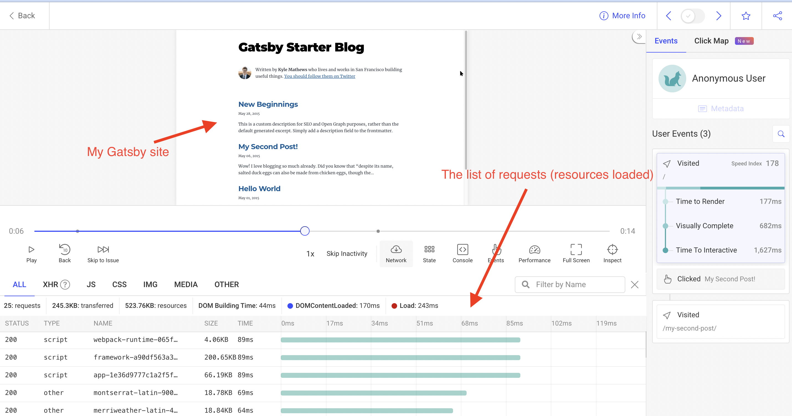

Установить трекер OpenReplay в проект на базе Gatsby относительно просто.



Учитывая, что Gatsby использует React под капотом, всё, что нам нужно сделать, — это добавить код трекера на главную страницу и вызвать метод `start` с помощью хука `useEffect`. 

Давайте посмотрим.

## Зачем настраивать трекер на статическом сайте?

Отсутствие динамического контента в вашем приложении не означает, что вы не хотите воспользоваться некоторыми другими возможностями OpenReplay.

Хотя вы не будете использовать повторы сессий для поиска багов, вы сможете собирать интересные метрики и создавать [собственные кастомные дашборды](https://docs.openreplay.com/tutorials/custom-dashboard) на основе этих метрик.

Вы можете использовать метрики производительности, web vitals и даже метрики, связанные с ресурсами, чтобы получить общее представление о том, какой опыт получают ваши пользователи на вашем сайте.

## Настройка трекера внутри Gatsby

Учитывая статический сайт на Gatsby, точкой входа которого является файл `index.tsx` в папке `pages`, вам нужно добавить в него следующий код:

```jsx
import Tracker from '@openreplay/tracker';
const tracker = new Tracker({
  projectKey: process.env.GATSBY_OPENREPLAY_PROJECT_KEY
});

const Index = ({data, location }) => {

  React.useEffect(() => {
    tracker.start();
  }, [])

   //the rest of your code here...
}
```

Трекер создаётся при компиляции страницы (будь то SSR или рендеринг на стороне клиента), но метод start можно вызвать только из браузера, поэтому нам нужно убедиться, что он вызывается после монтирования компонента (отсюда и хук `useEffect` здесь). Пустой массив в качестве второго аргумента хука `useEffect` гарантирует, что колбэк выполнится только один раз.

💡**Примечание для пользователей self-hosted версии:** если вы используете self-hosted версию OpenReplay, вам также потребуется указать свойство конфигурации `ingestPoint` при создании экземпляра трекера. Это свойство задаёт конечную точку приёма данных трекера. Пользователям Cloud это не нужно, потому что по умолчанию трекер знает, где находится SaaS-версия этой конечной точки, но если вы используете self-hosted версию, вам нужно её указать (она должна выглядеть примерно так: `https://openreplay.mydomain.com/ingest`)

## Работа с переменной ENV в Gatsby

В целях безопасности мы рекомендуем не прописывать project key прямо в коде. Это означает, что вам нужно будет экспортировать его как переменную ENV, чтобы Gatsby мог её прочитать.

Project key OpenReplay тогда будет храниться в переменной с именем `GATSBY_OPENREPLAY_PROJECT_KEY`

Обратите внимание, что имя имеет префикс `GATSBY_` — это укажет Gatsby сделать так, чтобы переменная была доступна и во фронтенд-коде. В противном случае вы не сможете прочитать значение, если только не выполняете код Node.js.

## Остались вопросы?

Вы можете [ознакомиться с этим репозиторием](https://github.com/deleteman/openreplay-gatsby-example), чтобы увидеть **полный исходный код** работающего приложения на базе Gatsby с трекером.

Если у вас возникнут какие-либо проблемы с настройкой трекера в вашем проекте Gatsby, свяжитесь с нами в нашем [сообществе Slack](https://slack.openreplay.com/) и задайте вопросы нашим разработчикам напрямую!